

 

    <h1 style="text-align: center;">Arduino</h1>

    <h2 style="text-align: center;">¿Qué es Arduino?</h2>

Un arduino se compone de dos partes principales, la física y digital.

 
<strong>Física</strong>

  

 La física se compone de una placa la cual puedes modificar o manejar a tu gusto
  

  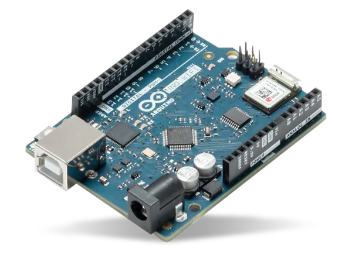
             

 
<strong>Digital</strong>

  

 La parte digital es la parte donde puedes escribir un código para darle una serie de instrucciones y así hacer que el Arduino tenga la función que tu quieras.
  

  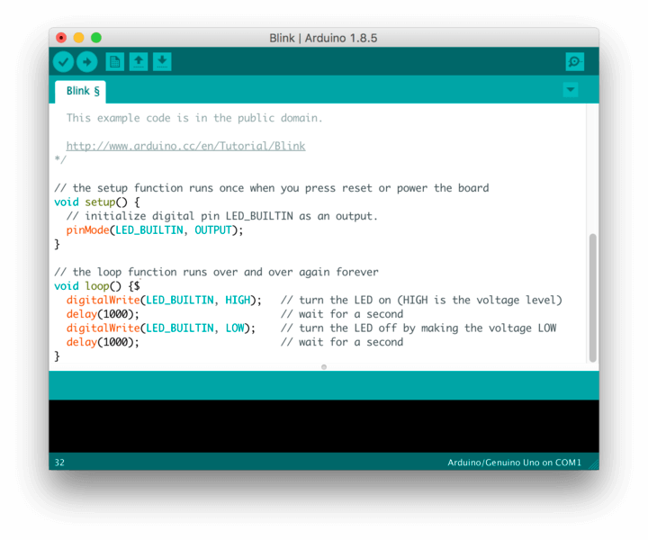
             

    <h2 style="text-align: center;">¿Cuál es su origen?</h2>

Arduino nació en 2005 en el Instituto de Diseño Interactivo de Ivrea, Italia. Fue creado por un equipo liderado por Massimo Banzi.
  

  
             

Su idea era ofrecer a los estudiantes una herramienta de proyectos electrónica que fuera sencilla, de bajo coste y rápida de aprender. Tras el cierre del instituto, el proyecto se liberó, impulsando su fama.

    <h2 style="text-align: center;">¿Cuáles son sus características mas importantes?</h2>

Arduino es de código abierto (hardware y software libres), los dos factores mas importantes son: 
<strong><li>Creatividad</li></strong>
La creatividad. Destaca por su flexibilidad para adaptarse y su facilidad de uso, ideal para principiantes gracias a un lenguaje de programación simple. 
<strong><li>Bajo coste</li></strong>
Su bajo coste lo hace accesible, y cuenta con una gran comunidad global que ofrece

    <h2 style="text-align: center;">¿Qué modelos hay?</h2>

Existen diversos modelos de Arduino, como el Uno, Mega, Nano y Leonardo. Cada uno varía en sus piezas, el voltaje que usa (generalmente 5V), y la cantidad de pines digitales y entradas analógicas. También se diferencian en la capacidad de memoria (Flash, SRAM, EEPROM) y la velocidad del reloj. Estas diferencias los hacen adecuados para distintos tipos y dificultades de proyectos.
  

  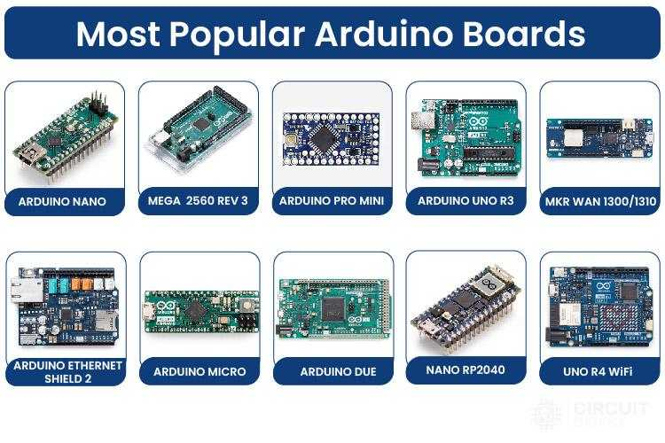
             

    <h2 style="text-align: center;">¿Para qué sirve?</h2>

 Arduino sirve para crear una gran cantidad de proyectos electrónicos y de robótica. Suele usarse para escuelas donde se enseña programación y donde se hacen trabajos básicos de robótica.
 <strong><li>Sistemas para casas</li></strong>
 Controla sensores y actuadores en sistemas interactivos.
   

  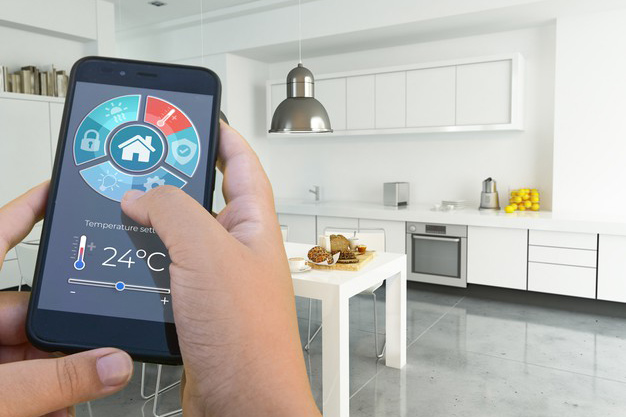
             

  <strong><li>Edificios automáticos</li></strong>
  Controla sensores y actuadores en sistemas interactivos.
     

  
             

    <h2 style="text-align: center;">¿Qué lenguaje utiliza?</h2>

Arduino se programa utilizando un lenguaje propio, el “C”, que a su vez está basado en C++.
   

  
             

es una versión simplificada, con funciones específicas para interactuar fácilmente con las placas del Arduino. Este lenguaje de programación mantiene una curva de aprendizaje más accesible para los principiantes.

    <h2 style="text-align: center;">¿Qué es el IDE?</h2>

El Arduino IDE es el Entorno de Desarrollo Integrado oficial y gratuito.
 

  
             

    <h2 style="text-align: center;">ACTIVIDAD 0 BLINK</h2>

Objetivo: Utilizaremos el ESP32-S3 WROOM para controlar el parpadeo de un LED común 
<strong>Lista de componentes:</strong>
   

  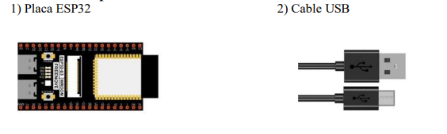
             

El ESP32-S3 WROOM necesita una corriente de 5v, aunque en esta actividad lo vamos a conectar directamente al PC vía el cable USB. 

<strong>Buscar en el manual de referencia la información del led azul que parpadea.</strong>

Es un codigo que hace que un LED parpadee de forma repetida. Esto es para indicar que la placa y el software funcionan correctamente.

<strong>¿Qué son el void setup() and void loop() ?</strong>

<li>El void setup() es para decirle al arduino cómo debe comportarse, dentro de esto estan los pines o la comunicación con el PC</li>
<li>El void loop() se centra en hacer cosas como leer sensores o controlar motores, es básicamente la parte que se debe ejecutar una y otra vez de manera infinita.</li>

<strong>¿Qué quiere decir la línea: #define LED_BUITIN 2 ?</strong>

 

Es un LED que viene soldado a la placa Arduino, casi siempre el pin 13, su uso es comprobar que el codigo funciona.

<strong>¿Qué quiere decir la línea delay(1000); ?</strong>

 

Le dice al Arduino que se detenga y no haga absolutamente nada durante el tiempo especificado, el numero se mide siempre en milisegundos, en este caso al ser 1000 es un segundo de espera.

    <h2 style="text-align: center;">ACTIVIDAD 1 LED</h2>

Ahora es que realmente vamos a comenzar a construir y explorar algunos proyectos basados en el chip ESP32-S3
WROOM. Utilizaremos para ello, nuestro chip para controlar el parpadeo de un LED común.

<strong>Lista de componentes:</strong>
   

  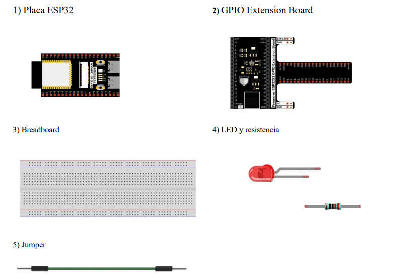
             

Vamos a construir nuestro circuito según se muestra en el diagrama. Solo después de construirlo es que podemos conectarlo al PC para verificar que es correcto.

  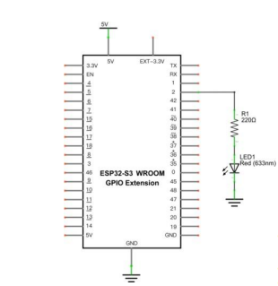
             
  
             

  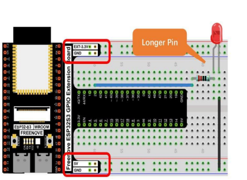
             
  
Aqui esta el codigo que se usa para el Arduino
            

  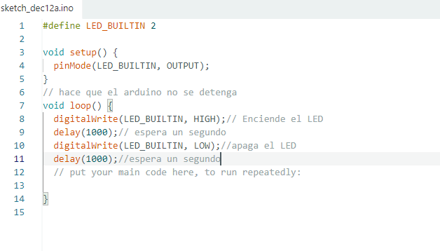
             
 
             

  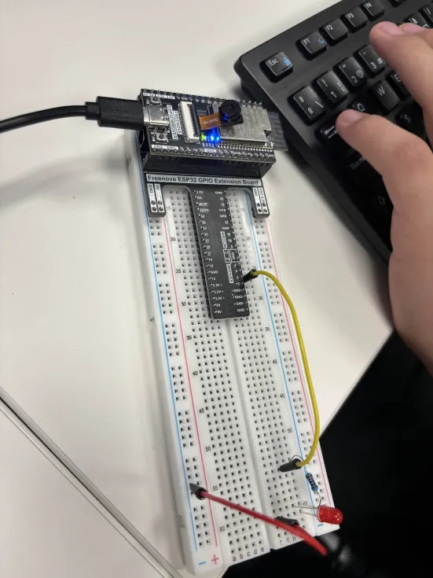
             
 
                         

  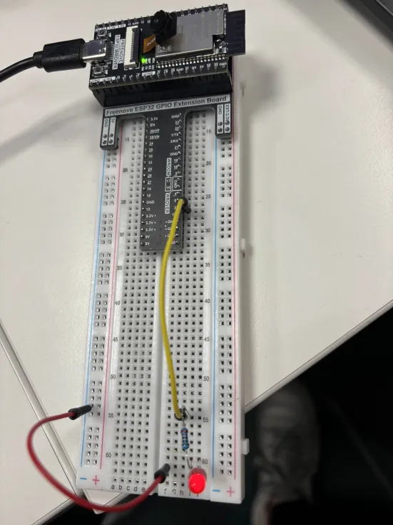
             
 
Aqui se puede observar el LED parpadeando y esperando 1 segundo

https://github.com/user-attachments/assets/49e49177-718f-447d-90b8-2797805de5da

    <h2 style="text-align: center;">ACTIVIDAD 2 SEMÁFORO</h2>

Componentes necesarios:
   

  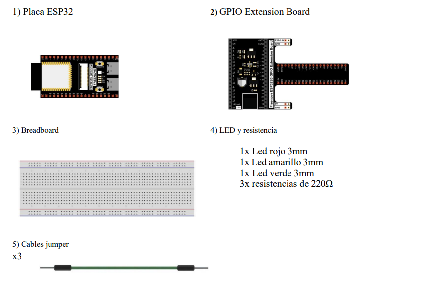
             

             Aqui esta el codigo de este ejercicio, en dicho código lo que le estamos ordenando a nuestro arduino es que debe encender las tres luces que le hemos puesto siguiendo el patrón de un semáforo.
   

  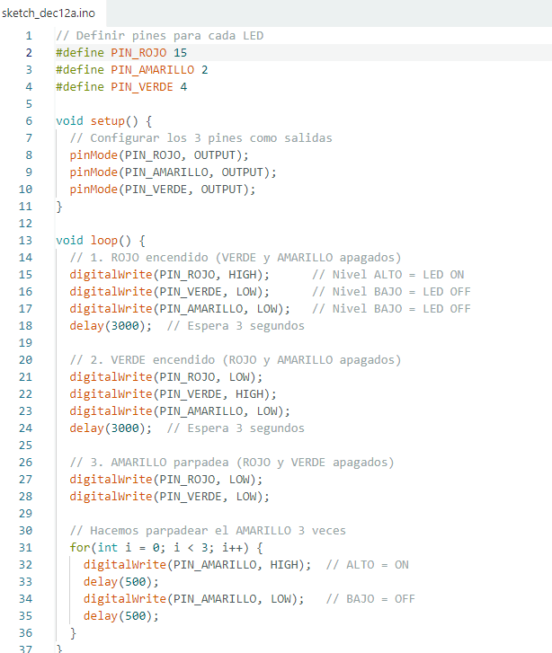
             

             Aqui se puede ver el esquema del circuito de dicho semáforo
  

  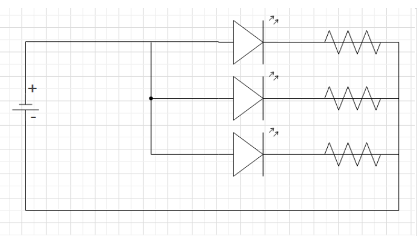
             

https://github.com/user-attachments/assets/5c37b494-c140-4cbd-9c3f-217365d051c2

    <h2 style="text-align: center;">ACTIVIDAD 3 BUTTON & LED</h2>

Componentes necesarios:
   

  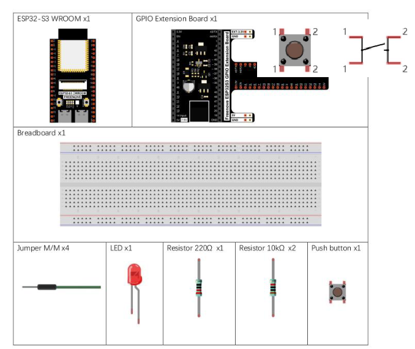
             

             Aqui esta el codigo de este ejercicio, en dicho código lo que le estamos ordenando a nuestro arduino es que debe encender la luz cuando pulsemos el botón
   

  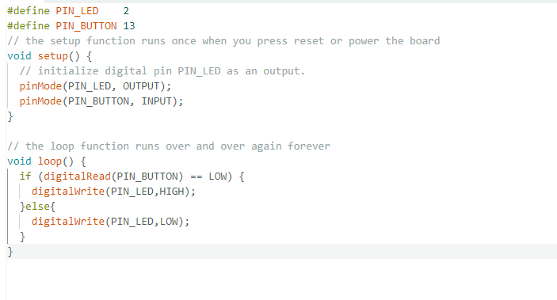
             

             Aqui se puede ver el esquema del circuito de dicho arduino
  

  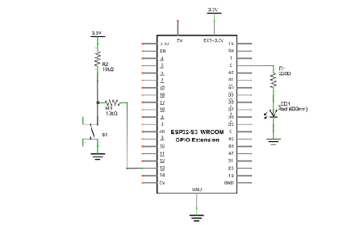
             

https://github.com/user-attachments/assets/34f02e2f-5f67-45fd-9deb-352e842ec188

    <h2 style="text-align: center;">ACTIVIDAD 4  MINI TABLE LAMP</h2>

Componentes necesarios:
   

  
             

Para esta práctica también usaremos un interruptor de botón, un LED para hacer una lámpara de mesa MINI, pero de manera diferente, esto es: al presionar el botón, el LED se encenderá y, al presionar el botón nuevamente, el LED se apagará. La acción del interruptor ya no es momentánea (como el timbre de una puerta), sino que permanece encendida sin necesidad de presionarlo continuamente.
   

  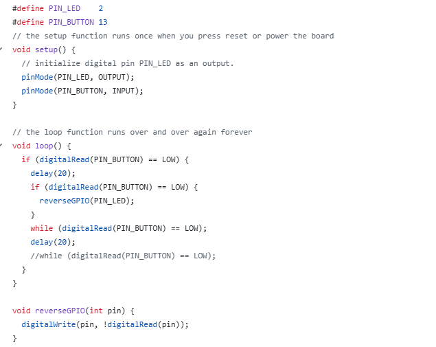
             

             Aqui se puede ver el esquema del circuito de dicho arduino
  

  
             

https://github.com/user-attachments/assets/0b8667d9-59fc-4b6e-8603-20c494ff2526

    <h2 style="text-align: center;">ACTIVIDAD 5 LED RGB</h2>

Componentes necesarios:
   

  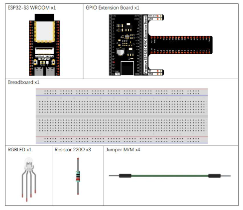
             

En esta Actividad aprenderemos cómo controlar un LED RGB y observaran que puede emitir diferentes colores de luz (usaremos LED RGB para crear una luz multicolor). También podrán entender la función random así como el concepto de gradiente y su aplicación en la actividad. Haremos un LED multicolor, controlando el LED RGB para cambiar entre diferentes colores automáticamente. 
<strong>1) Analizar y entender la diferencia entre un LED normal a un LED RGB. Para esto pueden crear una pequeña tabla de dos Columnas, donde la cabecera de cada columna serán los dos tipos de LED analizados en clase y que tendrá dos filas asociadas a los elementos comunes y las diferencias entre ellos. </strong>
 

  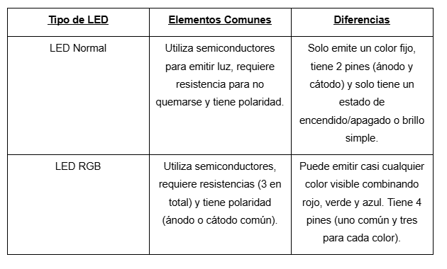
             

<strong>2) Que ocurriría en caso de invertir los colores del LED RGB por ejemplo que el pin 4 (Rojo) vaya a la pata del LED G(Verde) y el pin 0 a la pata del LED R(Roja). Porque cree que pase esto argumente su respuesta. </strong>
El LED seguirá funcionando, pero los colores estarán "cambiados". Si el programa pide rojo, verás verde porque el hardware y el código ya no coinciden. El pin de control envía la electricidad a una pata del LED que genera un color distinto al programado. 
<strong>3) Que sucede si comentamos dentro de la función void loop{}, la llamada a la función setColor(red, green, blue). Argumente lo que observa, después de volver a compilar el código. </strong>
El LED no encenderá o no cambiará de estado. setColor es la orden que envía el brillo a los pines. Si la borramos, el procesador calcula el color pero nunca le "avisa" al LED que debe encenderse. 

   

  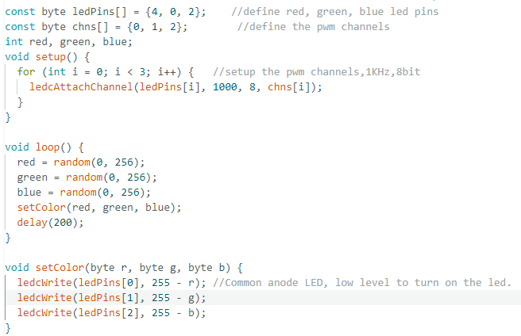
             

             Aqui se puede ver el esquema del circuito de dicho arduino
  

  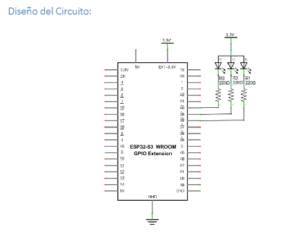
             

https://github.com/user-attachments/assets/d7e50a8a-eafa-423a-b32d-957b739f9aee

<strong>1) ¿Qué función tendría que dejar de utilizar para evitar el cambio aleatorio de los colores dentro del ciclo infinito? Explique que hace dicha función.</strong> 
Eliminando la funcion random() deja de ser random. 
<strong>2) Utiliza al menos dos combinaciones de colores (RGB) no aleatorias, que más le guste y donde se observen diferencias y argumente porque cree usted que se observa la tendencia hacia un color determinado.</strong> 
Si pones un valor de 255 en Rojo y 0 en los demás, el LED será rojo puro. Si pones 255 en Rojo y 255 en Azul, verás Violeta. 
<strong>3) ¿Qué sucedería si utilizamos la función aleatoria, pero regulamos los valores de la función random y pasamos los rangos que queremos? ¿Sería una forma de regular la coloración del LED RGB? Explique su respuesta brevemente.</strong> 
Sí, sería una forma de regular la coloración. 

https://github.com/user-attachments/assets/27c91968-7255-46bf-b115-0f35ceff82e2

<strong>1) Que observa tras cargar y correr el código del programa con respecto a lo que vimos antes. Explique la diferencia y argumente que es el gradiente y que es lo que hace (En el código) que en este ejercicio se pueda observar.</strong> 
El color cambia de forma suave y fluida en lugar de dar saltos bruscos. Es una transición continua entre colores. En el código se logra porque los valores RGB cambian paso a paso de 0 a 255. 
<strong>2) Explique que es el tipo de dato long y su diferencia con el int y porque se utiliza en el ejercicio.</strong> 
El long tiene mayor capacidad de almacenamiento que el int. Se utiliza porque los códigos de color en formato hexadecimal (como 0xAABBCC) son números muy grandes que no caben en un int estándar. 
<strong>3) Explique el funcionamiento de la función wheel de manera general.</strong> 
Esta función toma un valor numérico y lo traduce a una combinación exacta de rojo, verde y azul para recorrer todo el espectro cromático de forma circular. 
<strong>4) Busque en las referencias para que se utiliza la función ledcWrite() además indique cual es la salida de esta función y qué significado tiene en el código.</strong> 
Se utiliza para controlar el brillo de los canales PWM en el ESP32. Su salida es una señal que determina la intensidad de luz de cada pin, permitiendo mezclar los colores con precisión según el valor asignado.

    <h2 style="text-align: center;">ACTIVIDAD 4 LED BAR </h2>

Un gráfico de barras LED tiene 10 LED integrados en un componente compacto. Las dos filas de LEDs en su parte inferior están emparejadas para identificar cada LED como el único LED utilizado anteriormente. 
<strong>COMPONENTES NECESARIOS:</strong> 

<strong>1) Diseñar el circuito partiendo de la base que a cada pin de la barra LED irá conectado una resistencia de 220 ohm y del otro extremo a masa, los pines donde conectar a placa los escogeis vosotros. </strong>
Los pines que hemos usado nosotros son los: 0,2,15,34,35,32,33,25,26,27,13. 
<strong>2) Crear el diseño del circuito en cualquier herramienta de las que hemos trabajado en clase. </strong>

<strong>3) Si has probado el código verás que algo no funciona, localiza los errores, solvéntalos y explícanos por qué no funcionaba. </strong>
El código tenía 4 errores:
<li>ledPins[] = {}: Esta parte del codigo esta vacía, si no le decimos que pines usamos, el codigo no hara nada</li>
<li>pinMode(..., INPUT): Los LEDs deben ser OUTPUT. Si están en INPUT, no reciben energía suficiente.</li>
<li>i+: En los bucles for el incremento debe ser i++</li>
<li>delay(): Con los paréntesis vacíos el arduino no va a saber cuanto debe esperar.</li>
<strong>4) Cómo tengo que hacer si quiero que el LED empiece en otra posición, por ejemplo, en el medio y vaya de izquierda a derecha. (Sube el código modificado) </strong>
Para que el LED comience en el medio y se desplace hacia la derecha, debemos modificar el valor inicial del bucle for. 
 
<strong>5) Basándonos en la segunda práctica donde controlamos un botón con un LED, queremos que añadáis un botón y cada vez que lo pulséis se encienda el siguiente LED, y que cuando llegue al final rebote en bucle. </strong>
 

<strong>a. Video en funcionamiento. </strong>

https://github.com/user-attachments/assets/9b86fa40-f2c8-4c18-9ef7-e1f5b1ab03fb

<strong>b. Código.</strong> 

    <h2 style="text-align: center;">ACTIVIDAD 5 SERIAL IO </h2>

<strong>Proyecto 6.1) Serial comunication</strong>
Para esta práctica vamos simplemente a probar como funciona la comunicación de la placa con el ordenador para, en próximas prácticas, explotar esta funcionalidad. 
Componentes necesarios: 
 
Para poder observar la salida de información, debemos acudir a herramientas > Monitor serie y aparecerá una pestaña extra junto a la de “salida” por la que siempre leemos las incidencias con la placa. 
Pon el monitor serial en “115200 baud” para que funcione.
 

Utiliza el siguiente código: 
 

<strong>1. ¿Que aparece en serial monitor?</strong> 
 
<strong>2. Pulsa los botones de boot+EN que hay en la placa de Arduino, ¿qué ocurre? Ahora pulsa solo EN, ¿qué ha ocurrido? ¿para qué nos puede servir esto? </strong>
<li>BOOT+EN: Es fundamental cuando el ordenador no reconoce la placa automáticamente para subir un código. Obliga a la ESP32 a ponerse en modo escucha.</li>
<li> EN: Sirve para reiniciar el sistema si el código se queda bloqueado o si quieres volver a ver los mensajes iniciales del puerto serie.</li>
<strong>4. ¿Qué indica la linea de código “Serial.begin(115200);”?</strong>
Esta línea configura la velocidad de comunicación entre la placa y el ordenador a través del cable USB. 
<strong>5. Averigua que significa “%.1f s\n“</strong>
Esta es una cadena de formato que le dice a la función printf cómo mostrar los datos:
<li>%: Indica que aquí se va a insertar el valor de una variable.</li>
<li>.1f: Indica que el número es un decimal (float) y que solo queremos que muestre 1 decimal de precisión.</li>
<li>s: Simplemente imprime la letra "s" (de segundos) después del número.</li>
<li>\n: Es el comando de salto de línea. Hace que el siguiente mensaje aparezca en la línea de abajo en lugar de todo seguido.</li>
<strong>Proyecto 6.2) Panel LCD1602</strong> 
<strong>¿Qué necesitamos para hacer el proyecto?</strong> 
Una pantalla LCD1602 típica puede mostrar 2 líneas de caracteres en 16 columnas y es capaz de mostrar números, letras, símbolos, código ASCII, etc. A continuación, puedes ver los pines de los que dispone: 
 
Como puedes ver son muchos pines para tener controlados así que se simplifica en la versión I2C, que conecta la entrada en serie y la salida en paralelo, lo cual nos permite usar solo 4 líneas para operar la pantalla: 
 
El chip IC de serie a paralelo utilizado en este módulo es PCF8574T (PCF8574AT), y su dirección I2C predeterminada es 0x27(0x3F). 
¿Qué necesitamos para hacer el proyecto? 
 
<strong>1) Revisa las conexiones en el circuito eléctrico y explica para que se utiliza cada una</strong> 
<li>SCL: Es la línea de señal de reloj sincronizada que utiliza el protocolo I2C para coordinar el envío de datos entre la ESP32 y el LCD.</li>
<li>SDA: Es la línea por donde se transmiten físicamente los datos (el texto o comandos) de forma bidireccional.</li>
<li>VCC: Pin de alimentación que suministra energía eléctrica al módulo LCD. En el esquema se observa conectado a 5V.</li>
<li>GND : Conexión de referencia a tierra (0V) necesaria para cerrar el circuito eléctrico.</li>
<strong>2)¿Que hace la función “lcd.print()”? ¿Y “lcd.clear”?</strong> 
<li><strong>lcd.print():</strong>Es la función encargada de escribir texto o números en la pantalla.</li>
<li><strong>lcd.clear():</strong>Como su nombre indica, sirve para borrar todo el contenido de la pantalla.</li>
<strong>3) Por último, busca como conseguir que el mensaje de la primera fila se desplace de izquierda a derecha o a la inversa</strong> 

<strong>Proyecto 6.3) Panel LCD1602</strong> 
<strong>¿Qué necesitamos para hacer el proyecto?</strong> 
Un higrotermógrafo es un instrumento de medición utilizado para registrar y monitorizar las variaciones de temperatura y humedad relativa en el tiempo. Este es el circuito que debéis diseñar: 
 
<strong>Busca que hace esta linea “DHTesp dht; “ al principio del código. ¿Que es un objeto en programación y que es lo que hace?</strong>
<li>DHTesp: Es el plano que contiene las instrucciones para manejar los sensores de temperatura y húmedad. </li>
<li>dht: Es el nombre que le das a ese objeto específico para poder usarlo más adelante en el código.</li>
<strong>Prueba a codificar los valores para que muestre en la primera fila la temperatura en grados Kelvin y en la segunda fila en grados Farenheit.</strong>

    <h2 style="text-align: center;">ACTIVIDAD 6 WIFI </h2>

<STRONG>30.1 Station mode</STRONG>
En el modo estación el ESP32-S3 actúa como un cliente WiFi. Esto permite conectarse a la red del Router y comunicarse con otros dispositivos a través de la conexión WiFi. En la imagen siguiente podemos ver un PC que está conectado a un Router, al igual que el ESP32-S3 permitiendo la comunicación entre ambos. 
 
<strong>¿A qué red te has podido conectar? Es 5G, 2.4G? Explica.</strong> 
El ESP32-S3 se conecta exclusivamente a redes de 2.4 GHz. Su hardware no posee la circuitería necesaria para detectar o gestionar la banda de 5 GHz. 
<strong> ¿Son necesarias las tres: WiFi.h, WiFiClient.h, WiFiClientSecure.h)?</strong> 
No siempre. Para el código de ejemplo de "Station Mode" , solo es necesaria WiFi.h. Esta librería ya incluye las funciones básicas para conectar el chip al router y obtener una IP. Las otras dos son extensiones para funciones específicas. 
<strong> ¿En qué casos utilizaría las librerías de arduino WiFiClient.h y WiFiClientSecure.h? </strong>
<strong><li>WiFiClient.h:</li></strong>Se utiliza cuando tu ESP32 actúa como un cliente estándar para comunicarse con otros dispositivos o servidores de forma abierta.
<strong><li>WiFiClientSecure.h:</strong></li>Es la versión con "escudo". Se usa obligatoriamente cuando la comunicación debe ser segura y cifrada. 
<strong> Es posible seleccionar el canal de comunicación de la WiFi? Argumenta.</strong>  Sí, es totalmente posible seleccionar el canal de comunicación del WiFi en el ESP32. Esto se debe principalmente para evitar la saturación de canales, más o menos es como una carretera, más carriles mas fluidez para que no haya atascos.
<STRONG>30.2 Acess Point mode</STRONG> 
En este caso vamos a configurar nuestro ESP32 pero esta vez como un Access Point. Cuando el ESP32-S3 selecciona el modo AP, crea una red de punto de acceso que está separada de Internet y espera para que se conecten otros dispositivos WiFi. Ten en cuenta que los componentes son los mismos que en la actividad anterior.
El código del programa sería algo así (no es la única forma de hacerlo): 
 
<strong></strong>¿Cuál es el uso de softAPConfig? Argumenta</strong> 
El uso de softAPConfig es establecer una configuración de red específica y manual para el punto de acceso que crea el ESP32. 
<strong>¿Cómo puedo conocer la cantidad de dispositivos conectados a mi AP? Para ello investiga el uso de WiFi.softAPgetStationNum() y añade las líneas necesarias al código.</strong> 
Para conocer este dato se utiliza la función WiFi.softAPgetStationNum(), la cual devuelve un número entero con el total de clientes vinculados. 
<strong>¿Qué método me permite visualizar la dirección IP de la interfaz de red del punto de acceso?</strong> 
El método es <strong>WiFi.softAPIP().</strong> A diferencia de WiFi.localIP() (que se usa en modo Station para ver la IP que nos da el router), softAPIP() nos devuelve la dirección IP que el propio ESP32 tiene dentro de la red que él mismo ha creado. 
<strong>¿Qué nos permite la opción c_str() en el código?</strong> 
La opción c_str() es una función de la clase String de Arduino que convierte un objeto String en una cadena de caracteres estilo C. 
<strong>30.3 AP + Station Mode</strong> 
En los ejemplos anteriores o tenemos acceso a Internet porque nos conectamos a nuestro router desde el ESP32 o lo tenemos configurado como un AP, con lo cual no tenemos acceso a Internet. En este ejemplo vamos a poder utilizar ambos modos dado que activa el modo de estación de ESP32-S3, se conecta a la red del Router y puede comunicarse con Internet a través del mismo. Al mismo tiempo, activa su modo AP para crear una red. Otros dispositivos WiFi pueden optar por conectarse a la red del router o la red del AP para comunicarse con el ESP32-S3. 
Se trata de unir ambos códigos como se muestra a continuación: 
 
<strong>30.4 Una página web en el ESP32</strong> 
Cuando alguien se conecta a nuestro servidor se invoca una función y otra cuando se genera un error. Estas funciones las podemos llamar como queramos pero mejor si utilizamos la denominación estándar. Por supuesto, que las tenemos que crear y agregar como otras funciones que ya hemos utilizado. 
<strong>1) Explica brevemente los diferentes parámetros que se envían en las líneas siguientes:</strong> 
<strong>"server.send(200, "text/html", SendHTML("Hola a todos"));"</strong> 
<strong>"server.send(404,"text/plain", "No hay respuesta");"</strong> 
El método server.send() es el encargado de enviar la respuesta del ESP32 al navegador del usuario. Sus tres parámetros principales son:
<strong>-Código de estado HTTP (200 / 404):</strong>
<li>200: Indica que la petición ha sido exitosa (OK). El servidor encontró lo que el usuario buscaba.</li>
<li>404: Indica un error. El servidor no pudo encontrar el recurso solicitado (Not Found).</li>
<strong>-Tipo de contenido (MIME Type):</strong>
<li>"text/html": Le dice al navegador que lo que va a recibir es código HTML que debe renderizar visualmente.</li>
<li>"text/plain": Indica que es texto plano, sin formato ni etiquetas, tratándolo como un mensaje simple.</li>
<strong>-Cuerpo del mensaje (Payload):</strong>
<li>Es el contenido real que se verá en pantalla. En el primer caso, se llama a la función SendHTML("Hola a todos") que devuelve una cadena con la estructura de la web. En el segundo, es simplemente un string directo: "No hay respuesta".</li>
<strong>1)Añade las líneas de código correspondientes al servidor web. Cambia el puerto de comunicación de la página web.</strong> 
 
Aqui esta el codigo funcional y con el puerto de comunicacion de la pagina web cambiado al 8080.

    <h1 style="text-align: center;">ACERO IMPURO</h1>

<h2 style="text-align: center;">INTRODUCCIÓN</h2>

<strong>Elite Arduino Battle</strong> es un proyecto de robótica competitiva desarrollado por el equipo "La Elite". Consiste en el diseño, programación y ensamblaje de dos vehículos autónomos o controlados por Arduino, equipados con sistemas de ataque y defensa para combate en arena.
El objetivo fundamental es la supervivencia: cada coche protege un punto débil (globo) mientras intenta perforar el del adversario mediante un arma frontal personalizada. Los fundadores de este proyecto son:

<strong>¿POR QUÉ ESTA IDEA?</strong>

Como entusiastas de la tecnología, buscábamos un proyecto que combinara la programación lógica con la ingeniería física. La idea de los "Coches de Combate" nos permite experimentar con la movilidad, el diseño de estructuras en 3D y la estrategia en tiempo real.

Además, este proyecto nos apasiona porque traslada la competitividad de los videojuegos al mundo real, permitiéndonos ver físicamente el resultado de nuestro código y diseño mecánico.

<strong>¿HASTA DÓNDE QUEREMOS LLEGAR?</strong>

El objetivo principal es lograr una integración perfecta entre el hardware y el software. Queremos que los coches no solo se muevan, sino que sean precisos y resistentes. Los hitos específicos son:

<li><strong>Control Total:</strong> Dominar el manejo de motores y sensores mediante código limpio y eficiente.

</li>
<li><strong>Diseño e Impresión 3D:</strong> Crear piezas personalizadas para el soporte de armas y blindaje, optimizando el peso y la resistencia.

</li>
<li><strong>Autonomía y Respuesta:</strong> Conseguir que el sistema de ataque sea funcional y que el chasis soporte el impacto sin desmontarse.

</li>
<li><strong>Aprendizaje Técnico:</strong> Documentar todo el proceso para que sirva de base a futuros proyectos de robótica más complejos.

</li>

<strong>OBJETIVOS DE APRENDIZAJE</strong>

En el proyecto se potenciarán diversas habilidades técnicas:

<li><strong>Hardware:</strong> Conexión de controladores de motores (L298N), sensores y alimentación externa.

</li>
<li><strong>Software:</strong> Programación en C++ (IDE de Arduino) y gestión de bibliotecas de movimiento.

</li>
<li><strong>Fabricación Digital:</strong> Uso de software de modelado 3D e impresión para la creación de componentes físicos únicos.

</li>
<li><strong>Resolución de Problemas:</strong> Diagnóstico de fallos en circuitos y depuración de errores lógicos en el código.

</li>

<strong>REQUISITOS TÉCNICOS Y MATERIALES</strong>

<strong>FÍSICOS

</strong>
<li>2 Kits de Coche Arduino (Chasis, motores, ruedas)

</li>
<li>Placas Arduino (Uno/Elegoo)

</li>
<li>Servomotores (para el movimiento del arma)

</li>
<li>Globos (Punto débil)

</li>
<li>Armas punzantes (Chinchetas, agujas o plástico afilado 3D)

</li>
<li>Material de oficina (Cartón, bridas, cinta americana)

</li>
<li>Impresora 3D (para soportes personalizados)

</li>

<strong>LÓGICOS

</strong>

<li>Arduino IDE (Entorno de desarrollo)

</li>
<li>Bibliotecas: <code>Servo.h</code>, <code>NewPing.h</code> (si se usan sensores)

</li>
<li>Tinkercad / Fusion 360 (Diseño 3D)

</li>
<li>Github (Control de versiones del código)

</li>

<h2 style="text-align: center;">METODOLOGÍA DE TRABAJO</h2>

<strong>FASES DE IMPLEMENTACIÓN</strong>

Para asegurar el éxito del combate, seguiremos estos pasos estructurados:

<strong>1. Creación de los coches:</strong> Ensamblaje de la estructura base y conexión de motores y baterías.

<strong>2. Desarrollo del Código:</strong> Implementación de la lógica de movimiento y pruebas de respuesta.

<strong>3. Diseño de Armamento:</strong> Prototipado del objeto punzante y su mecanismo de accionamiento.

<strong>4. Integración 3D:</strong> Impresión de soportes para fijar el arma y el globo de forma segura al chasis.

<strong>5. Pruebas de Combate:</strong> Testeo de colisiones y efectividad de perforación.

<h2 style="text-align: center;">RECURSOS Y DOCUMENTACIÓN</h2>

<strong>GUÍAS Y TUTORIALES</strong>

Contamos con documentación técnica de alta calidad para el montaje base:
<li><strong>Documentación oficial:</strong> <a href="https://docs.keyestudio.com/projects/KS0470/en/latest/">Keyestudio KS0470 Smart Car</a></li>
<li>En este enlace se encuentran los esquemas eléctricos y ejemplos de código necesarios para el movimiento inicial.</li>

<h2 style="text-align: center;">DESAFÍOS Y SOLUCIONES</h2>

<strong>IDENTIFICACIÓN DE RIESGOS</strong>

| Desafío | Estrategia / Solución Prevista | 
| Elección del Chasis | Decidir entre kit pre-hecho por rapidez o diseño 0 para mayor personalización. | 
| Mecanismo de Ataque | Evaluar si el arma será fija o móvil mediante un servomotor. | 
| Estabilidad del Punto Débil | Diseñar un soporte 3D que mantenga el globo rígido pero expuesto. | 
| Consumo de Energía | Uso de baterías Li-ion separadas para motores y placa Arduino. | 

<h2 style="text-align: center;">RED Y CONECTIVIDAD</h2>

<strong>DIAGRAMA DE CONEXIÓN (HARDWARE)</strong>

Esencial para entender el flujo de energía y datos entre los componentes.

<h2 style="text-align: center;">FASE FINAL</h2>

<strong>COCHE FUNCIONAL CONSEGUIDO</strong>

Aqui se puede ver como el coche ya funciona con la APP movil y con sus 4 direcciones/funciones completamente operativas y listas para el combate
 
https://github.com/user-attachments/assets/e5bbce68-fe37-42ff-8248-b45136dbe03e

