

    <h1 style="text-align: center;">ELITEGG</h1>

# 📖 Índice del Proyecto EliteGG

> Navega rápidamente por las diferentes secciones del documento.

- 🧭 **[Introducción](#introducción)**
- 🗄️ **[Informe Backend de DB](#informe-de-backend-de-db)**
- 🏗️ **[Arquitectura del Software](#arquitectura-del-software)**
- ⚙️ **[Tecnologías a Utilizar](#tecnologías-a-utilizar)**
- 🌐 **[Red](#red)**
- 💻 **[Web](#web)**
- 🖥️ **[Servicios](#servicios)**
- 📊 **[Conclusiones](#conclusiones)**
- 📚 **[Bibliografía](#bibliografia)**

    <h2 id="introducción" style="text-align: center;">🧭INTRODUCCIÓN</h2>

    EliteGG es una plataforma de análisis y seguimiento de estadísticas para distintos videojuegos, principalmente League of Legends, diseñada para jugadores que quieren mejorar y llevar un control más organizado de su progreso.
El objetivo es crear una página similar a OP.GG, pero con una interfaz más clara, ordenada y con nuevas herramientas exclusivas para la comunidad. Los fundadores de este proyecto son:
      
    

    
<strong>¿POR QUÉ ESTA IDEA?</strong>

    

Como usuarios habituales de este tipo de páginas, creemos que sería interesante crear una que sea nuestra. Además, el tema nos apasiona, ya que trata de un videojuego que se disfruta en el tiempo libre. 
Otra razón importante es poder desarrollar una página que resuelva los fallos de las webs existentes en este ámbito. Al ser usuarios recurrentes de estos servicios, se ha identificado varias áreas de mejora y funcionalidades que serán muy útiles e interesantes para la comunidad.

<strong>¿HASTA DÓNDE QUIERO LLEGAR CON ESTE PROYECTO?</strong>

El objetivo principal es crear una página que sea realmente útil y consistente tanto a nivel técnico como a nivel visual, para ello se ha analizado distintas páginas ya existentes y listado las funcionalidades que la página acabará conteniendo. Dichas funciones son: 
<li><strong>Estadísticas personales detalladas:</strong> consultar historial de partidas, campeones más jugados y rendimiento por rol... </li>
<li><strong>Comparación con otros jugadores:</strong> medir tu nivel frente a amigos o rivales y descubrir en qué aspectos puedes mejorar. </li>
<li><strong>Calendario de eventos:</strong> Accede a un calendario con torneos, eventos y novedades del juego para no perderte nada. También puedes guardar algún equipo en concreto como favorito para recibir un correo cada vez que este tenga un partido. </li>
<li><strong>Consejos personalizados:</strong> Sugerencias de mejora basadas en tu estilo de juego y datos de la comunidad, como por ejemplo sugerencias de objetos según el campeón que quieras jugar y en contra de cuáles juegues. También te hará una plantilla donde podrás elegir qué campeones te gusta jugar para darte consejos de qué campeón de aquellos que te gustan deberías elegir en contra de enemigos concretos. </li>
<li><strong>La página también va a incluir videos de una corta duración haciendo una demostración de las habilidades de los personajes y de sus diferentes aspectos.</strong> </li>

 
<strong>¿A QUIÉN VA DIRIGIDO ESTE PROYECTO?</strong>

 

El proyecto está dirigido a la comunidad de League of Legends, un factor que nos beneficia mucho en términos de visibilidad. Al ser un juego para todos los públicos, el único "requisito" para usar nuestra plataforma es jugar al juego. Aunque más adelante, si es posible, se incluirán más videojuegos, ya que así el alcance podrá ser mayor y así abarcar otras comunidades.

 
<strong>MÓDULOS DEL CICLO QUE TENGAN QUE VER CON EL PROYECTO</strong>

  

 En el proyecto se incluirán varios módulos del curso: 
<li>Aplicaciones web: Este módulo es fundamental, ya que necesitamos desarrollar una página web funcional y atractiva. Para ello, utilizaremos lenguajes de programación como HTML y CSS. </li>
<li>Seguridad: La seguridad es un aspecto crucial. Implementaremos medidas para proteger nuestros servidores y la información de los usuarios (como sus nombres y contraseñas) contra posibles ataques o robos de datos. </li>
<li>Sistemas operativos en red: Este módulo se aplicará directamente en el uso de máquinas virtuales (MV) para nuestros servidores, lo cual es esencial para el despliegue del proyecto. </li>
<li>Servicios en red: Este módulo será imprescindible, ya que utilizaremos herramientas esenciales como DNS para el funcionamiento de nuestra plataforma. </li>

<strong>MATERIALES NECESARIOS</strong>

<strong>FÍSICOS </strong>
<li>Ordenadores </li>                                                         
<strong>LÓGICOS </strong>
<li>Virtual Box (VM)  </li>
<li>Canva </li>
<li>Chatgpt </li>
<li>Deepseek </li>
<li>IA (Gemini) </li>
<li>Visual Studio Code </li>
<li>Vercel </li>
<li>Trello </li>
<li>Github </li>
<li>Corrector </li>
<li>Servicio DHCP en un servidor Windows diferente </li>
<li>Servidor DNS primario </li>
<li>Firewall: pfSense o Sophos </li>
<li>Backup: Truenas y/o rsync </li>
<li>Plan de contingencia </li>

    

    <h2 id="informe-de-backend-de-db" style="text-align: center;">🗄️INFORME DE BACKEND DE DB</h2>

<strong>IDENTIFICACIONES DE ENTIDADES PRINCIPALES</strong>

<strong>¿Qué elementos importantes hay en tu web que necesitan almacenarse? </strong>
Usuarios y contraseñas, plan de eventos de los partidos oficiales, imágenes personajes, imágenes objetos, videos de las skins y habilidades (muchos videos), imágenes de cada juego para la primera página, y las recomendaciones que te da según tu personaje.
  
<strong>¿Qué tema de información almacena? </strong>
Usuarios (con contraseñas), fechas, imágenes, videos.

  
<strong>¿Por qué necesitas guardarla en la base de datos?</strong> 
 Aquí tenemos una tabla donde se explica de manera resumida la razón por la cual hay que guardar cada tipo de dato.
      

  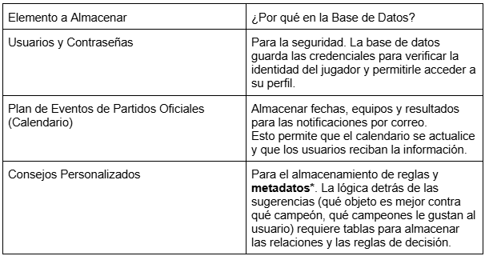

<strong>*Los metadatos son los datos extendidos sobre un primer dato, en esta tabla improvisada hemos puesto de ejemplo un campeón (Jinx) que en este caso sería el dato.
Todo lo que muestra la tabla serían los metadatos de este campeón. </strong>
 Aquí tenemos un ejemplo de lo que serían los metadatos en un personaje aleatorio de nuestra página, en este caso jinx.
      

  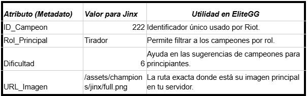

<strong>DATOS QUE SE DEBEN GUARDAR DE CADA ENTIDAD (ATRIBUTOS)</strong>

Para cada entidad identificada en el punto anterior, describe qué información concreta se necesita guardar.
Por ejemplo, si una entidad es “Usuario”: 
<li>Nombre</li>
<li>Apellidos</li>
<li>Correo electrónico</li>
<li>Contraseña</li>
<li>Fecha de registro</li>
      
<strong>Indica el tipo de dato esperado (texto, número, fecha, etc.) y la definición que consideras que corresponde (varchar, int, decimal...)</strong> 

  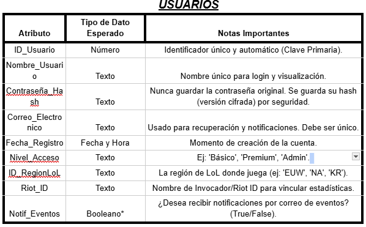

    <strong>*Booleano:</strong> Los datos booleanos son datos que se usan para conceptos positivos y negativos 
Si/No 
Verdadero/Falso 
Afirmativo/negativo 

  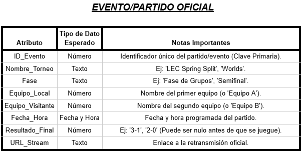

  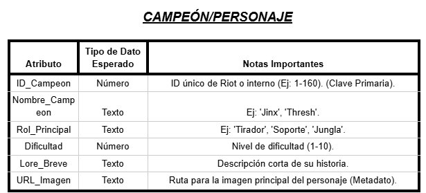

  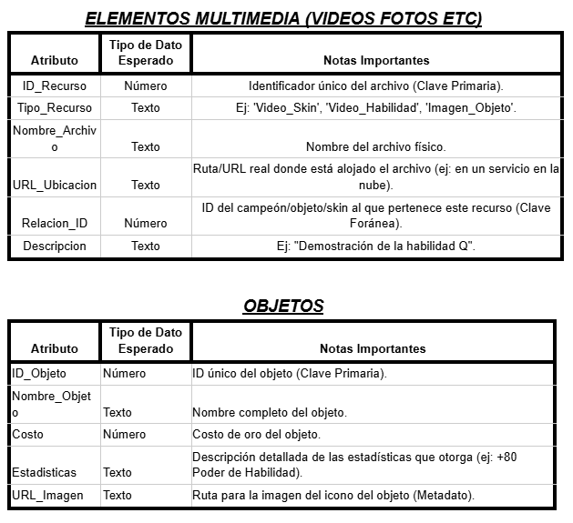

<strong>RELACIONES ENTRE TABLAS</strong>

    

        
<strong><li>USUARIOS y CAMPEÓN/PERSONAJE (Estadísticas y Progreso)</li></strong>
Esta es la relación central para el análisis de estadísticas personales. 

<strong><li>USUARIOS y EVENTO/PARTIDO OFICIAL (Notificaciones y Favoritos)</li></strong>
Esta relación permite al sistema enviar las notificaciones por correo de los partidos favoritos. 

<strong><li>CAMPEÓN/PERSONAJE y OBJETOS (Consejos Personalizados)</li></strong>
Esta relación es fundamental para la funcionalidad de sugerencia de objetos e ítems contra campeones enemigos. 

<strong><li>CAMPEÓN/PERSONAJE u OBJETOS y ELEMENTOS MULTIMEDIA (Recursos)</li></strong>
Esta relación vincula los archivos de medios (imágenes, vídeos de skins, videos de habilidades) con la entidad a la que pertenecen. 

<strong>EJEMPLOS DE DATOS</strong>

    Incluye un ejemplo de cada entidad con datos ficticios pero realistas. 
      
  

  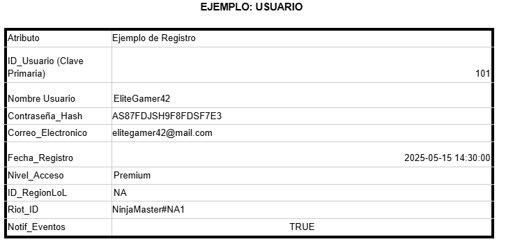
  
  

  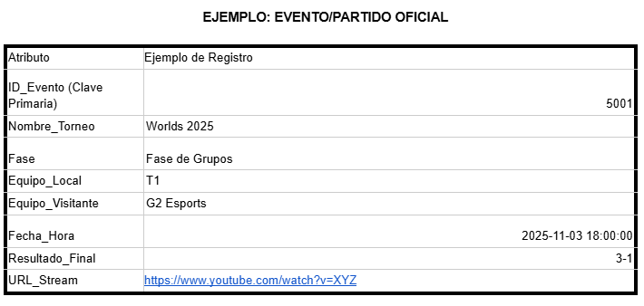
  
  

  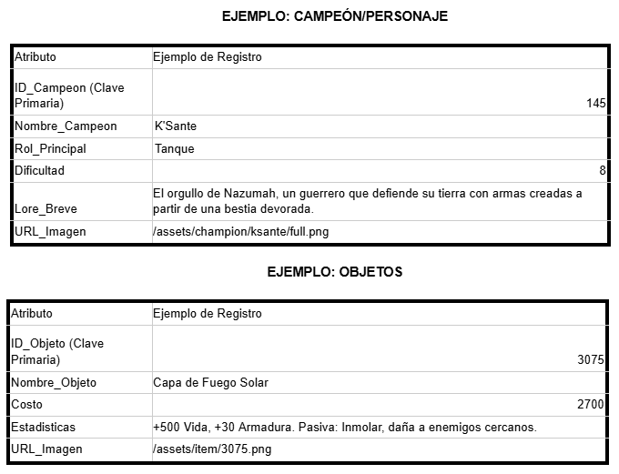
  

 

  

<strong>LISTA DE DATOS DB</strong>

  

  

   
<strong>USUARIOS</strong>

   

   <li>Riot ID</li>
   <li>Contraseña</li>
   <li>Correo</li>
   <li>Teléfono</li>
   <li>Fecha de registro</li>
  

  

<strong>CAMPEONES</strong>

   <li>ID Campeón</li>
   <li>Nombre del campeón</li>
   <li>Apodo</li>
   <li>Rol principal</li>
   <li>Clase</li>
   <li>Lore del campeón</li>
   <li>Estadísticas del campeón nvl 1</li>
   <li>Imagen del campeón</li>
   <li>Habilidades</li>
   <li>Combos</li>
   <li>Skins</li>
   <li>Precio</li>
  

   

    
<strong>BUILDS</strong>

    <li>ID Build</li>
    <li>Runas</li>
    <li>Items</li>
   

  

    
<strong>ITEMS</strong>

   <li>ID de Item</li>
   <li>Nombre de items</li>
   <li>Precio de Items</li>
   <li>Venta de Item</li>
   <li>Estadísticas de item</li>
   <li>Imagen de Item</li>
   <li>Activación</li>
   <li>Pasiva</li>
   <li>Lore de Item</li>
   <li>Rama de Creación</li> 
  

   

       
<strong>RUNAS</strong>

    <li>ID Runa</li>
    <li>Runa Padre</li>
    <li>Runa Secundaria</li>
    <li>Estadísticas adicionales</li>
   

   

       
<strong>E-SPORTS</strong>

    
    <li>Equipos</li>
    <li>Ligas</li>
    <li>Jugadores</li>
   

     

       
<strong>EQUIPOS</strong>

   
    <li>ID Equipo</li>
    <li>Nombre del Equipo</li>
    <li>Foto del Equipo</li>
    <li>Jugadores del equipo</li>
    <li>Logros del equipo</li>
    <li>Historia del equipo</li>
    <li>Redes sociales del equipo</li>
    <li>Calendario de equipo</li>
     

        

       
<strong>JUGADORES</strong>

   
    <li>ID Jugador</li>
    <li>Nombre del equipo</li>
    <li>Foto del jugador</li>
    <li>Rol del jugador</li>
    <li>Trayectoria del jugador</li>
    <li>Premios del jugador</li>
    <li>Redes sociales del jugador</li>
    <li>Campeón preferido (provisional)</li>
        

         

       
<strong>LIGAS</strong>

 
    <li>ID liga</li>
    <li>Nombre de la liga</li>
    <li>Foto de la liga</li>
    <li>Equipos</li>
    <li>Región</li>
         

        
 
   

<strong>RELACIONES DB</strong>

 
 
 Aqui se podra observar las relaciones que habrá entre las distintas tablas de la base de datos, junto a las claves foráneas y Claves Primarias de cada una de ellas. Esta está creada utilizando la plataforma MYSQL Workbench.
    

          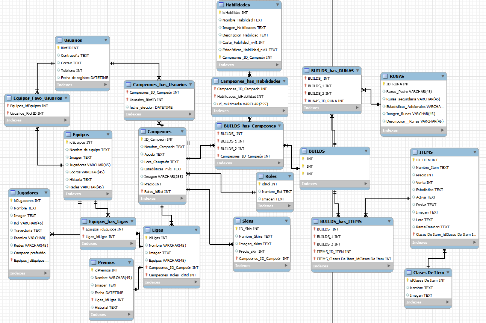
    

    <h2 id="arquitectura-del-software" style="text-align: center;">🏗️ARQUITECTURA DEL SOFTWARE</h2>

 
<strong>OBJETIVOS</strong>

  

 Estos són en formato lista los objetivos que tenemos con nuestra página: 
 <li>Desarrollar un sistema de registro/login seguro (intentaremos vincular el RIOT ID de los usuarios para poder verificar con más certeza quien accede a la página).</li>
   

 <li>Mostrar el historial de partidas, los campeones más jugados y el rendimiento por rol del usuario autenticado en una interfaz clara.</li>
    

          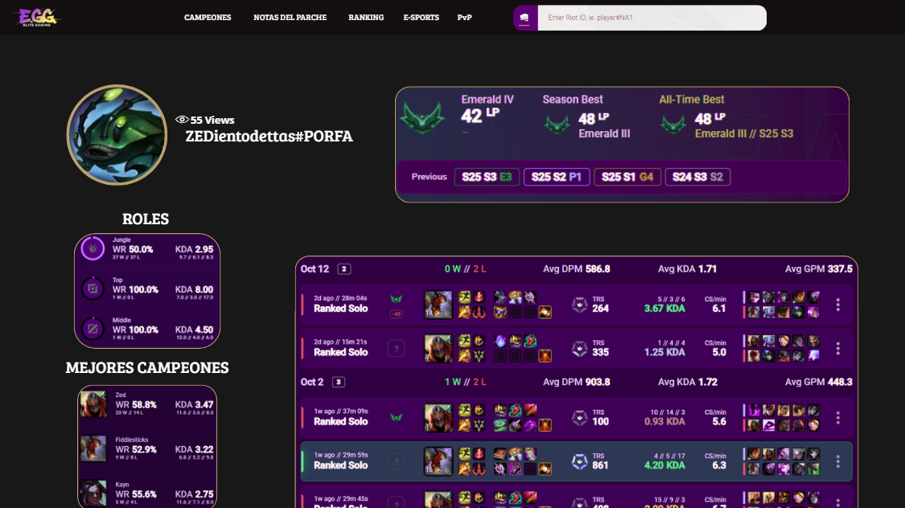
    

   

 <li>Implementar la funcionalidad de Combos rápidos y explicación de las habilidades del mismo basada en el campeón que le gusta al usuario.</li>
   

  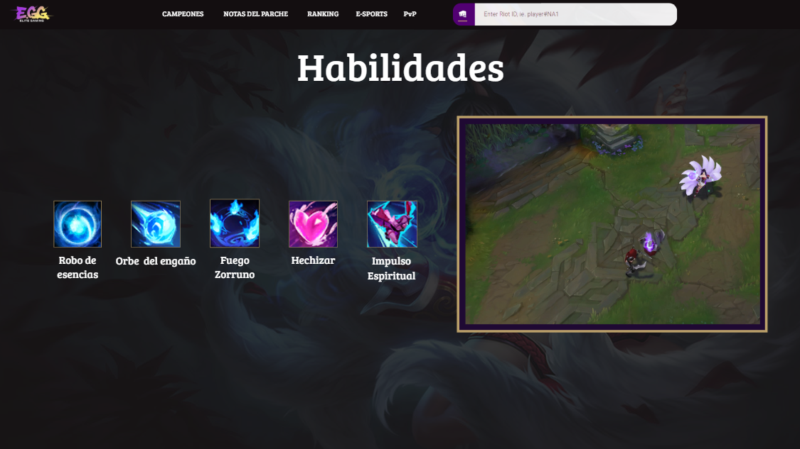
             

  

  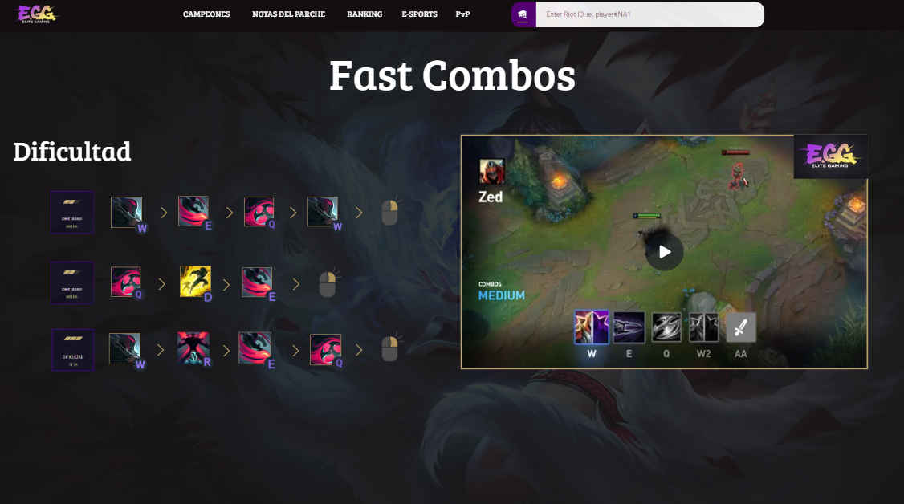
             

   

 <li>Integrar un calendario de eventos oficiales de LoL con la capacidad de que los usuarios marquen equipos favoritos para recibir notificaciones por correo.</li>
       

  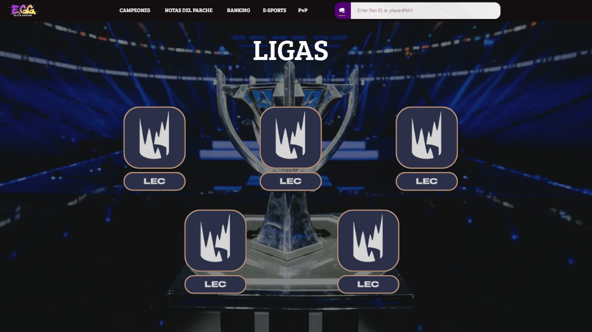

   

 <li>Botón de PvP, sirve para poder seleccionar 2 cuentas diferentes y comparar diferentes aspectos de ambos jugadores mostrados en pantalla.</li>
       

  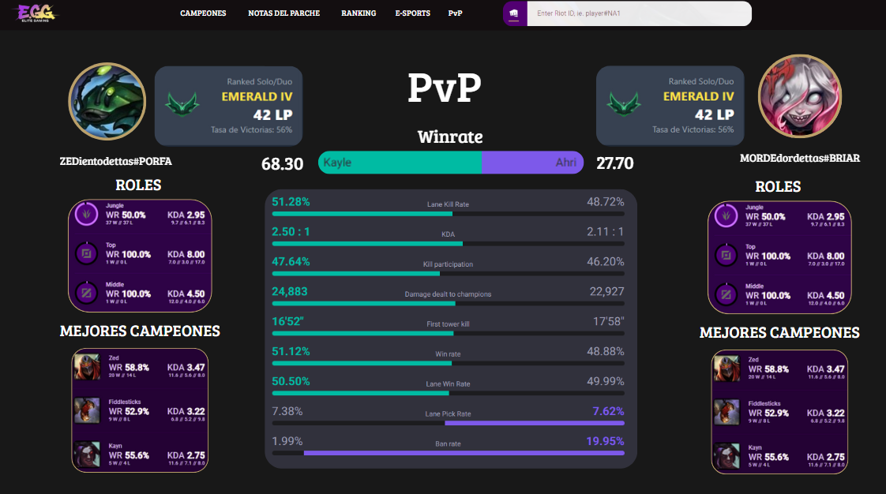

    

 <li>Base de datos donde almacenemos los campeones actuales del juego con sus historias resumidas para los curiosos que les guste mirar más allá del juego.</li>
  

  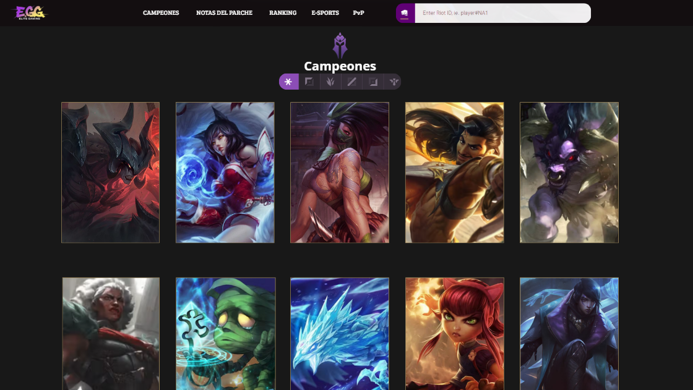

     

 Ranking de los mejores jugadores que se actualiza de manera automática, pudiendo entrar a los perfiles de esos jugadores TOP.
 

  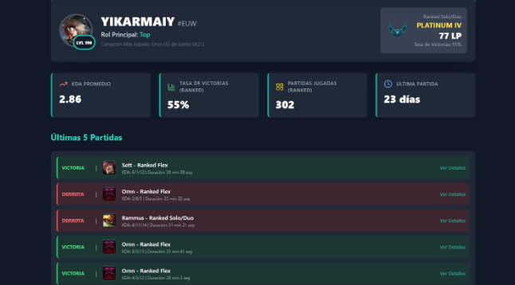

 
<strong>RESPONSABLES DE TAREAS</strong>

 

 Cada miembro del equipo de trabajo se encargará de diferentes aspectos del proyecto, intentando aportar cada uno en el aspecto que más destaca.
 

  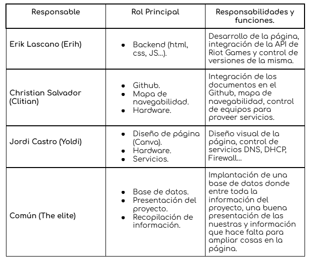

 
<strong>DATOS QUE SE VAN A SOLICITAR</strong>

  

 <strong>-Datos solicitados al usuario</strong>
<li>Riot ID (El cual ya está vinculado a un correo electrónico).</li>
<li>Nombre de usuario</li>
<li>Contraseña</li>
<li>Teléfono móvil</li>
<li>Correo electrónico</li>
<strong>-Tipos de usuarios</strong>
<li>Usuario sin cuenta: Este usuario solo tendrá acceso a la galería de campeones y sus derivados, pero no podrá ni guardar configuraciones ni equipos seleccionados ni recibir notificaciones de manera automática.</li>
<li>Usuario ya registrado: Este usuario ya puede tener tanto equipos favoritos, cuentas y campeones, además de tener la opción de tener notificaciones automáticas.</li>
<li>Administradores: Cuenta que solo tendremos los propietarios de la página para poder modificar pequeñas cosas de la base de datos.</li>
<strong>-Tipos de datos</strong>
 

  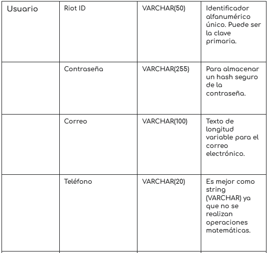

 

  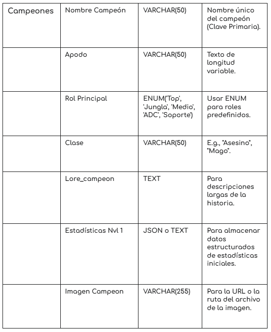

  

  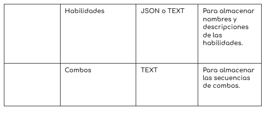

 

  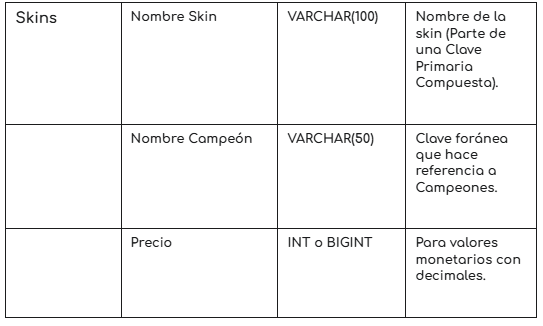

  

  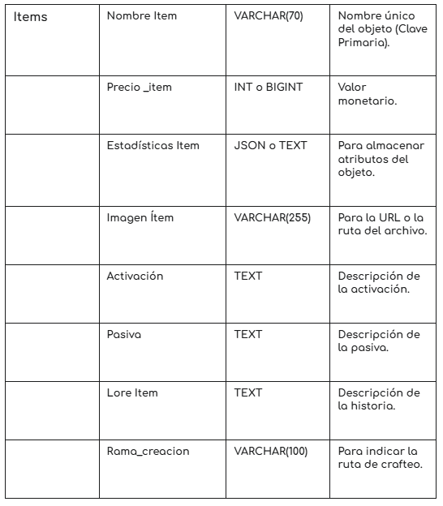

  

  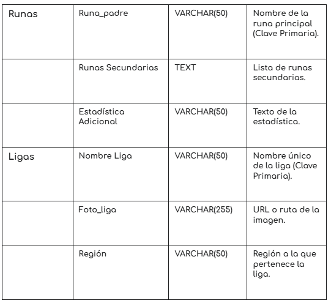

   

  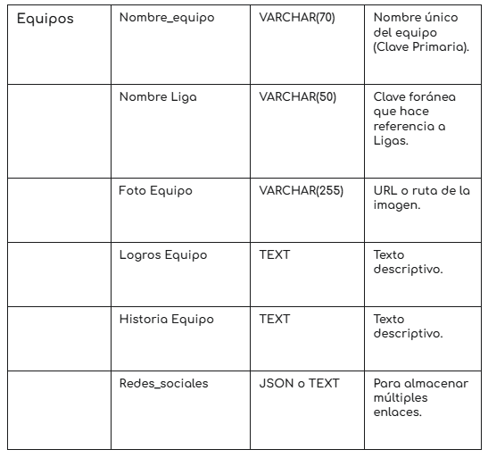

    

  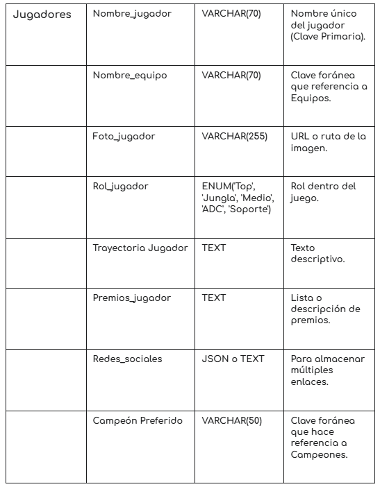

 

  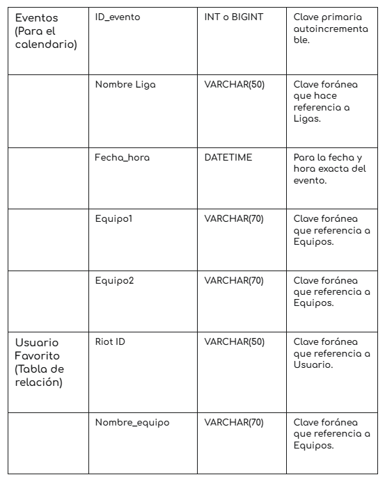

 <strong>DEFINICIONES DE LO QUE QUEREMOS USAR:</strong>
 <li><strong>Varchar (X):</strong> Este tipo de dato está hecho para carácter variables, lo que habrá entre  los paréntesis será el número máximo de bits que podremos usar, por ejemplo, si lo que tengo que sacar es un “hola” solo usará 4 bits, sin desperdiciar el resto.</li>
 <li><strong>ENUM:</strong> ENUM se utiliza para un campo donde solo se permite uno de un conjunto predefinido de valores.
Todo valor que no esté dentro de esa lista predefinida, se devolverá.</li>
 <li><strong>Text:</strong> Formato de texto libre. </li>
 <li><strong>Int o Bigint:</strong> Números enteros sin decimales.</li>
 <li><strong>DATETIME:</strong> Para registrar un momento exacto, incluyendo tanto la fecha como la hora.</li>
 <li><strong>JSON (JavaScript Object Notation):</strong> Se usa para almacenar datos complejos y semi-estructurados, como listas anidadas o pares clave-valor.</li>

    <h2 id="tecnologías-a-utilizar" style="text-align: center;">⚙️TECNOLOGÍAS A UTILIZAR</h2>

El proyecto usará diferentes programas para poder ser funcional, las detallaremos en formato lista:
  

 
<strong>PROGRAMAS</strong>

 

 

 
<strong>DNS</strong>

 Traduce el nombre de dominio a la dirección IP del servidor donde se aloja la web, permitiendo a los usuarios encontrar la plataforma.

 
<strong>DHCP</strong>

No es esencial para la web pública, pero se usaría internamente en la red de desarrollo o producción para asignar IPs automáticas a los servidores y máquinas virtuales.

 
<strong>MYSQL</strong>

Es un sistema de gestión de bases de datos relacionales, para almacenar datos estructurados de Campeones, Objetos y Usuarios. Ademas instalaremos phpmyadmin para tener una interfaz grafica.

 
<strong>PIHOLE</strong>

Se usaría en la red de desarrollo para bloquear publicidad y rastreadores a nivel de red para un entorno de trabajo más limpio.

 
<strong>Github</strong>

Plataforma de control de versiones obligatoria donde se almacenará el código fuente del proyecto, gestionando ramas y la colaboración del equipo. Ademas el codigo de nuestra web se encontrara dentro de un repositorio de github el cual estara ligado a nuestro nginx.

 
<strong>Firewall</strong>

Software de seguridad de red que protege el servidor, filtrando el tráfico malicioso y asegurando que solo los puertos necesarios (80, 443, 8080) estén accesibles.

 
<strong>NGINX</strong>

Gestiona y distribuye eficientemente las peticiones HTTP y sirve el contenido estático.

 

  
<strong>ExpressJS</strong>

  Procesa y ejecuta el código dinámico de las aplicaciones para enviárselo a Nginx. Usamos este programa en lugar del PHP debido a que el codigo de la web esta compuesto por un formato tipo TSX.

 
<strong>SO QUE VAMOS A UTILIZAR</strong>

 <li>Plataforma de Virtualización = Proxmox</li>
 <li>Servidor de Backup = Debian</li>
 <li>Servidores DNS = Debian</li>
 <li>Servidor de Aplicación/Web/DB = Debian</li>
 <li>Dhcp + Router = Debian (interfaz gráfica) + IP tables</li>
 <li>Máquinas de Desarrollo = Windows 11</li>
 

    <h2 id="red" style="text-align: center;">🌐RED</h2>

    
<strong>DIAGRAMA DE LA RED</strong>

 Este es el plano de cómo va a estar estructurada la red del proyecto.
  

  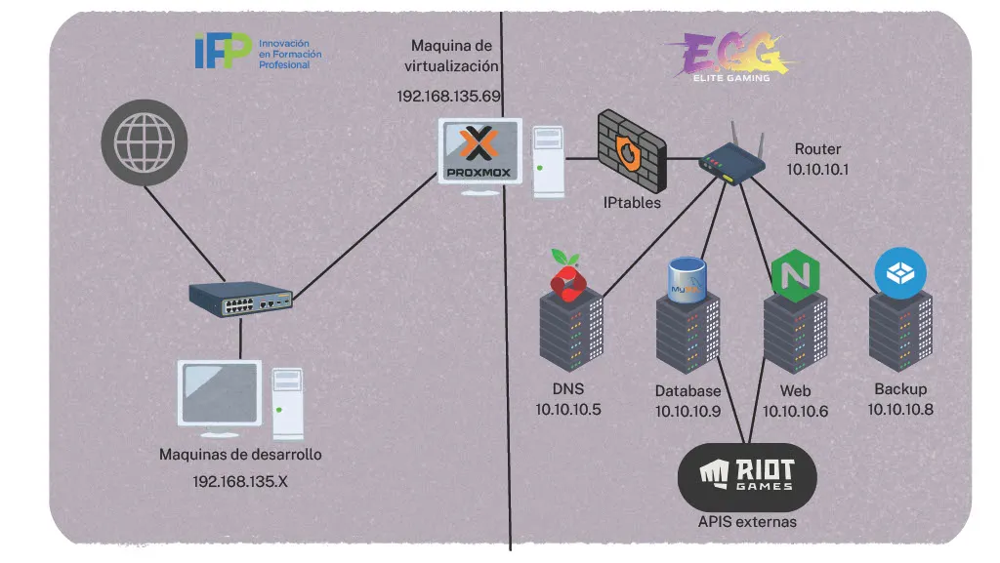

    <h2 id="web" style="text-align: center;">💻WEB</h2>

Aqui tendremos la planificación a nivel tanto visual como interactivo de lo que será nuestra web.

    
<strong>MOCKUP</strong>

    

Aquí se podrá observar las bases a nivel visual de lo que será la página web de EliteGG. Para empezar la paleta principal de colores que compone la página son el negro, blanco, morado y amarillo, esto para dar una sensación de estilo neon ya que la página está dirigida al gaming. Seguido esto tenemos cada apartado de la página.
      
    

    
<strong>Home page</strong>

     

      En nuestra Home page se encuentra primeramente una barra superior que contiene distintos objetos, comenzando por nuestro logo en un formato más pequeño y en la parte izquierda de la barra, seguido de "<strong>Campeones</strong>", "<strong>Notas del parche</strong>", "<strong>Ranking</strong>", "<strong>E-Sports</strong>", "<strong>PvP</strong>" y por último un buscador, y como se puede ver, estos últimos objetos se encuentran en la parte central de la barra superior, dicha barra superior se conservará en cualquier parte de la página. Seguido a esto, abajo tenemos el logo de "<strong>EliteGG</strong>" con un fondo del videojuego "<strong>League of Legends</strong>" y en su parte inferior otro buscador igual al anterior. Por último en la parte inferior tenemos un video decorativo del videojuego "League of Legends" que se reproduce de manera automática.
    

  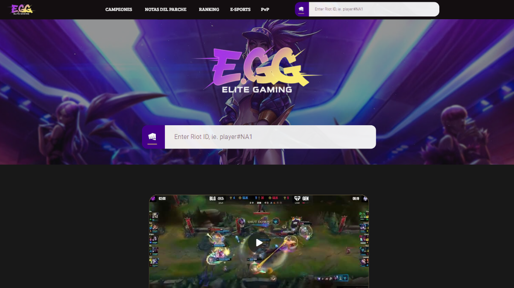
  

    
 
     

    
<strong>Galeria de campeones</strong>

         

        En nuestra galería de campeones se puede observar un filtro para de esta manera poder encontrar a cualquier campeón en concreto de manera más rápida y sin que el usuario pierda el tiempo de manera innecesaria, los campeones están presentados con un formato de tarjeta para que de esta forma se les pueda apreciar correctamente.
    

          
    

     

    

       
<strong>Perfil de Jugador</strong>

         

          En esta plantilla visual se puede observar el perfil de un jugador aleatorio, en dicho perfil se puede obtener distinta información, como puede ser su nivel de cuenta dentro del videojuego, cuánta gente ha visualizado su perfil, su rango, el historial de partidas, los roles que juega y las indicaciones de con cuánta frecuencia los juega junto al porcentaje de partidas que gana con cada rol y cuáles son los campeones que juega más.
    

          
    

    

     
<strong>PvP</strong>
  
         

       En <strong>"PvP"</strong> lo que ocurre es la comparación de cuentas de dos jugadores distintos, se deja de mostrar el historial de partidas y se comparan estadísticas en formato de porcentajes de ambos jugadores, de esta forma se puede analizar quien de los dos tiene un nivel más alto.
        

  

    

    

      
<strong>E-sports</strong>

         

             En la sección <strong>"E-sports"</strong> hay distintas funciones, cuándo el usuario accede a <strong>"E-sports"</strong> se le muestra en primer lugar una selección de las distintas ligas que hay en activo en este momento, una vez escoge la liga se le muestra un calendario con las fechas de los partidos que habrá en el futuro, junto a una lista general de todos los equipos, en esta parte de la página el usuario también tiene la opción de añadir un equipo como favorito, por último el usuario también puede acceder dentro de un equipo en concreto para ver la plantilla de jugadores con la que cuenta.
        

  

    

    

         
<strong>Campeón</strong>

         

         Este es el plano de lo que aparecerá una vez entremos a un campeón en concreto, habrá dos formas de hacerlo, ya sea buscando su nombre en las barras de búsqueda o en la galería de campeones, una vez entremos lo que podremos observar serán imágenes de los distintos aspectos de dicho campeón, acompañadas del su respectivo nombre y en un formato llamado "carrusel". Además haciendo scroll hacia abajo habrá distintos botones que te llevarán a las siguientes ubicaciones:  
        <strong>
        <li>Build </li>
        <li>Habilidades </li>
        <li>Matchups </li>
        <li>Fast Combos </li>
        <li>Parches </li></strong>
    Todo esto enfocado al personaje que hayamos escogido anteriormente. Por último si el usuario decide seguir scrolleando se encontrara con una sección especial de la historia del campeón.
         

  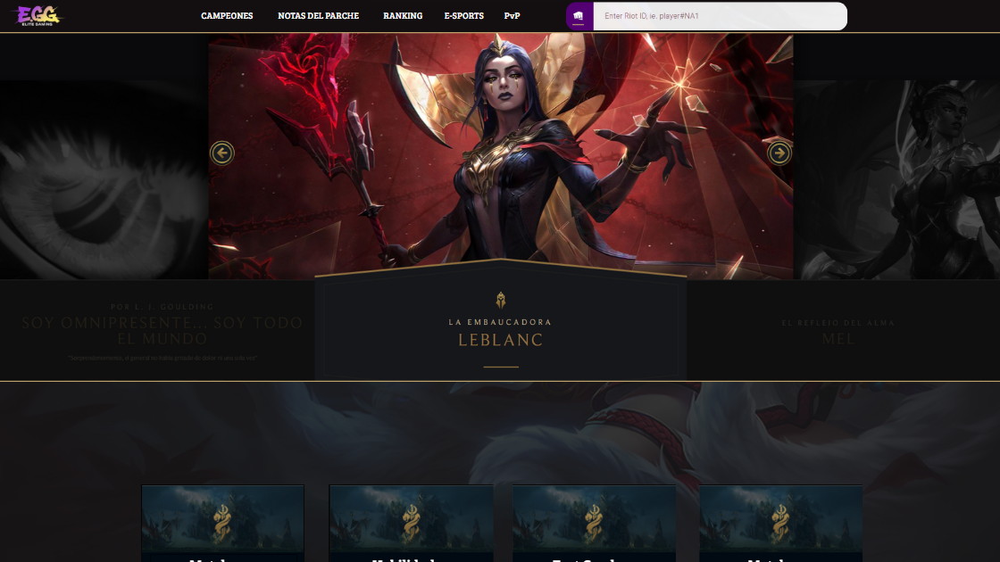

    

    

          
<strong>Habilidades</strong>

         

       Este es el plano de uno de lo que se verá dentro del boton <strong>"Habilidades"</strong> anteriormente mencionado. Aqui se podrá observar todas las habilidades del campeón que hayamos seleccionado, acompañadas de un video demostrativo y una descripción de cada habilidad respectivamente.
         

  
             

    

      
 

          
<strong>Builds</strong>

         

                     Esto será lo primero que vea el usuario una vez entre al apartado de <b>"BUILD"</b>, aqui se muestran tres tipos de build entre las que el usuario podrá escoger la que mas le guste.
  

  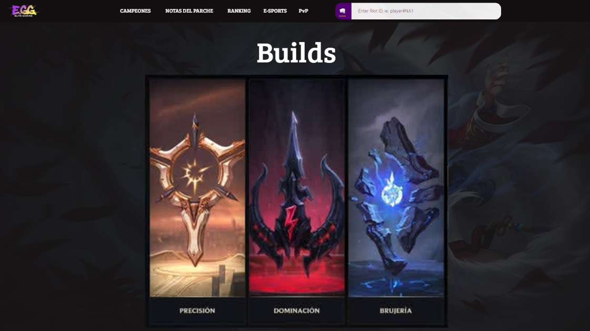
             
  
               Una vez escogida una build se te mostrara a detalle las <b>"Runas"</b> del tipo de build que el usuario haya escogido.         
    

  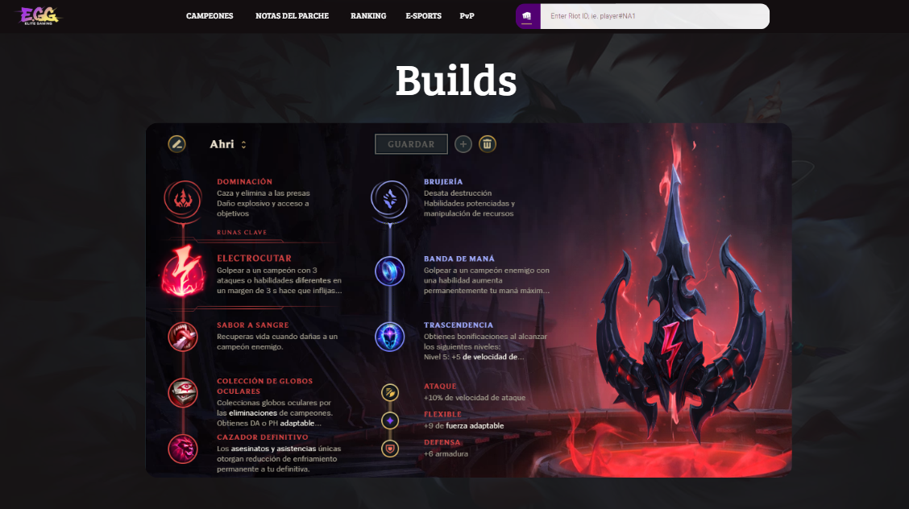
             

   Después de las runas se mostrará una guia de los objetos que el usuario se debe comprar, junto al orden en el que lo debe hacer y el porcentaje de partidas que suelen ganar.
             

  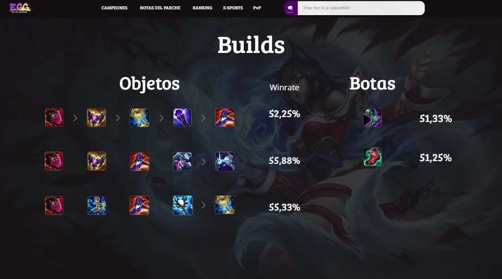
             
 
 

   

   
<strong>Matchups</strong>

         

   Esto es lo que verá el usuario una vez entre a la sección "Matchups" del campeón que haya escogido anteriormente, aqui se podrá observar que tan bueno es tu campeón en contra de otro en concreto, acompañado de una lista general de campeones que contrarrestan el tuyo, y que campeones son contrarrestados por tu personaje.       
  

  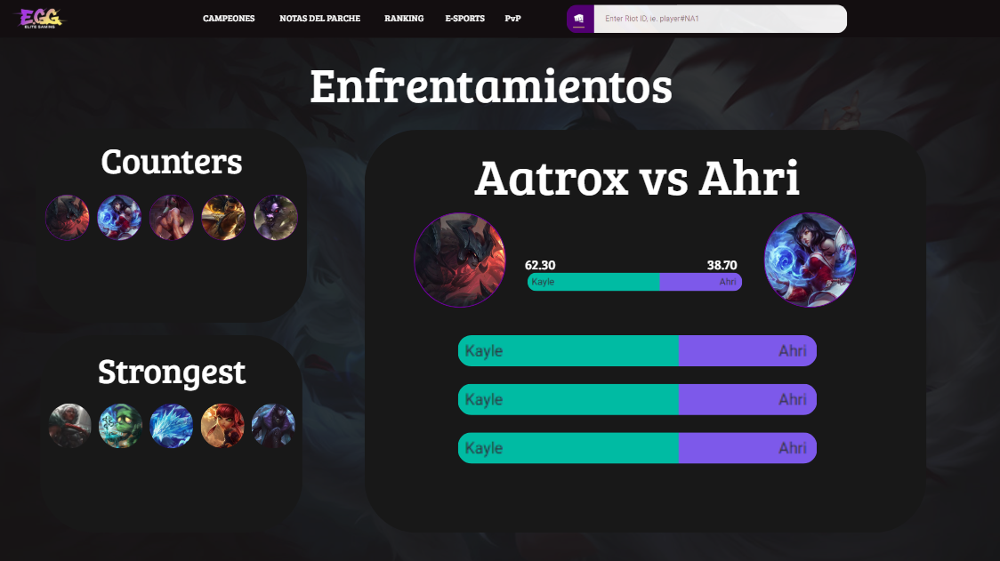
             

   

   

   
<strong>Combos</strong>

     

      En este apartado de la página web el usuario podrá acceder a una lista de distintos combos del personaje que haya escogido anteriormente, cada combo tendra una serie de pasos y un video de demostración para llevarlo a cabo y que el usuario los pueda entender de manera clara, además los combos están divididos por dificultad.
 

  
             

             

             

    
<strong>MAPA DE NAVEGABILIDAD</strong>

 

 El mapa de navegabilidad de EliteGG está creado haciendo uso de la herramienta llamada "Miro". Aqui está el link para poder acceder a este: 
 <a href="https://miro.com/app/board/uXjVJ5uIMTM=/?share_link_id=5953744281"> <target=blank>Acceder al Mapa</a>. Este mapa tiene una estructura perfectamente pensada, los rombos representan la "Home page", los cuadrados morados representan botones/objetos interactuables, y los cuadrados amarillos representan aspectos puramente visuales. La estructura de la web está perfectamente interconectada unas funciones con otras, de esta manera el usuario puede llegar a cualquier parte de la web con la menor cantidad de clics posible.     

    <h2 id="servicios" style="text-align: center;">🖥️SERVICIOS</h2>

  
  

  
<strong>PROXMOX</strong>

  

Es la plataforma de virtualización de código abierto que actúa como el "estadio" de nuestro proyecto. Nos permite ejecutar y gestionar máquinas virtuales (VM) y contenedores (LXC) sobre un único servidor físico, optimizando el hardware al máximo.

   

<strong>¿Por qué es clave para EliteGG?</strong>

  <ul>
    <li><strong>Aislamiento Total:</strong> Cada servicio (Web, DNS, SQL) vive en su propio entorno independiente, aumentando la seguridad y evitando fallos en cadena.</li>
    <li><strong>Snapshots (Puntos de restauración):</strong> Permite crear "puntos de guardado" antes de realizar cambios críticos, pudiendo revertir cualquier error en segundos.</li>
    <li><strong>Gestión de Recursos:</strong> Asignación dinámica de CPU y RAM según las necesidades de la carga de trabajo de EliteGG.</li>
  </ul>
  
<strong>Adaptación al Proyecto EliteGG:</strong>

  
Proxmox es el pilar que sostiene nuestra infraestructura mediante:

  <ul>
    <li><strong>Virtualización KVM:</strong> Utilizada para el Router y el Servidor Web, garantizando un aislamiento completo del Kernel.</li>
    <li><strong>Contenedores LXC:</strong> Utilizados para el servicio Pi-hole, permitiendo un alto rendimiento con un consumo mínimo de recursos (512MB RAM).</li>
    <li><strong>Networking Virtual:</strong> Creación de puentes (Bridges) para segmentar la red interna <code>10.10.10.x</code> de la red externa.</li>
  </ul>

  
<strong>Comandos y Gestión:</strong> 
  <small>
    • Acceso a consola vía Web (192.168.135.69:8006). 
    • Gestión de almacenamiento local y backups automáticos. 
    • Monitoreo de latencia y rendimiento de nodos en tiempo real.
  </small>

  
<strong>Links de referencia:</strong> 
  <small>
    • <a href="https://www.proxmox.com/en/proxmox-ve/get-started">Primeros pasos con Proxmox VE</a> 
    • <a href="https://pve.proxmox.com/pve-docs/">Documentación Técnica (Wiki)</a> 
    • <a href="https://punkymo.gitbook.io/miwiki/virtualizacion/proxmox"> Documentación Alina</a>
  </small>

  

 
<strong>DIVISIÓN DE CONTENEDORES LCX</strong>

 Un contenedor LXC (Linux Containers) es una tecnología de virtualización ligera a nivel de sistema operativo para entornos Linux. Para este proyecto se hará uso de esta tecnologia de esta manera:  
<strong><li>Máquina Virtual (VM 101)</li></strong>
 Gateway / Firewall (iptables) / DHCP (isc-dhcp-server).
 <strong><li>Contenedor de DNS (CT 105)</li></strong>
 Pi-hole (DNS + Bloqueador de anuncios)
<strong><li>Contenedor de Base de Datos (CT 107)</strong></li>
 MySQL (Base de Datos)
 <strong><li>Contenedor WEB (CT 104)</strong></li>
Nginx

  

  
<strong>SERVIDOR DNS Y FILTRADO (PI-HOLE)</strong>

  

  
  
Será el encargado de conseguir que nuestra web tenga un "nombre" para poder buscarse, en lugar de solo su dirección IP,ademas ser nuestro bloqueador de anuncios, usaremos Pi-Hole el cual instalaremos en un Contenedor LXC con el sistema operativo Debian y podremos configurarlo a partir de su interfaz web.

  
  

  
<strong>¿Por qué es clave para EliteGG?</strong>

  <ul>
    <li><strong>Bloqueo de Publicidad:</strong> Elimina anuncios y trackers a nivel de red, reduciendo el tráfico innecesario y acelerando la navegación.</li>
    <li><strong>Privacidad:</strong> Evita que los dispositivos envíen telemetría y datos de uso a servidores externos no autorizados.</li>
    <li><strong>DNS Local:</strong> Permite acceder a nuestros servicios mediante nombres (ej: <code>web.elite.local</code>) en lugar de recordar IPs.</li>
  </ul>

  
<strong>Adaptación al Proyecto EliteGG:</strong>

  
Integrado como un servicio ligero que protege la integridad de la red interna:

  <ul>
    <li><strong>Eficiencia LXC:</strong> Ejecutado en un contenedor Linux para minimizar el uso de recursos del nodo Proxmox (512MB RAM).</li>
    <li><strong>Control Centralizado:</strong> Proporciona un panel administrativo para visualizar en tiempo real quién y qué se está bloqueando.</li>
    <li><strong>Protección de Servidores:</strong> Evita que el Servidor Web o la DB conecten con dominios maliciosos conocidos.</li>
  </ul>

  

  
<strong>Incidencias y complicaciones:</strong> 
 Durante la instalación del servidor DNS tuvimos bastante problemas de conexión ya que requeriamos de que nuestro router nos proporcionara conexión a nuestra red interna, como despues de varios intentos fallidos no conseguimos nada, añadimos una segunda interfaz de red (Provisional) que tuviese salida a "Internet" para poder instalar nuestro servicio, una vez solucionado este problema ya no se nos presento ninguna otra incidencia.
    

  
<strong>Comandos y Gestión:</strong> 
  <small>
    • Acceso a consola vía Web (10.10.10.5/admin). 
    • Actualización de listas Gravity: <code>pihole -g</code>. 
    • Monitoreo de consultas en tiempo real: <code>pihole -t</code>.
  </small>

  
<strong>Links de referencia:</strong> 
  <small>
    • <a href="https://docs.pi-hole.net/">Documentación Oficial Pi-hole</a> 
    • <a href="https://firebog.net/">Listas de Bloqueo Recomendadas (Firebog)</a> 
    • <a href="https://discourse.pi-hole.net/">Foro de la Comunidad Pi-hole</a>  
    • <a href="https://punkymo.gitbook.io/miwiki/virtualizacion/proxmox"> Documentación Alina</a>
  </small>

  
<strong>GATEWAY Y SEGURIDAD PERIMETRAL (ROUTER DEBIAN)</strong>

  

  
Es el nodo central de comunicaciones de la infraestructura. Actúa como una puerta de enlace (Gateway) inteligente que interconecta la red externa (WAN) con nuestra red interna segmentada (LAN 10.10.10.x), gestionando todo el flujo de datos y la seguridad de los paquetes.

  

  
<strong>¿Por qué es clave para EliteGG?</strong>

  <ul>
    <li><strong>Aislamiento de Red:</strong> Crea una barrera de seguridad que impide el acceso directo desde el exterior a los servidores críticos como SQL o Pi-hole, protegiendo el "core" del proyecto.</li>
    <li><strong>Port Forwarding (Redirección):</strong> Permite que servicios internos (como la web en el puerto 3001 o la API en el 3000) sean accesibles desde fuera mediante una única IP gestionada.</li>
    <li><strong>Control de Tráfico (NAT):</strong> Gestiona el enmascaramiento de IPs para que todas nuestras VMs internas tengan salida a Internet de forma segura y transparente.</li>
  </ul>

  
<strong>Adaptación al Proyecto EliteGG:</strong>

  
Configurado como un firewall robusto basado en software para el control total de la red:

  <ul>
    <li><strong>Doble Interfaz de Red:</strong> Una interfaz en modo puente (192.168.135.50) y otra interna privada (10.10.10.1).</li>
    <li><strong>IP Forwarding:</strong> Habilitado a nivel de Kernel (sysctl) para permitir el salto de paquetes entre subredes de forma fluida y con las minimas perdidas posibles.</li>
    <li><strong>Persistencia de Reglas:</strong> Implementación de <code>iptables-persistent</code> para garantizar que la configuración de red no se pierda tras un reinicio del servidor.</li>
  </ul>

  
<strong>Comandos y Gestión:</strong> 
  <small>
    • Ver reglas de redirección activas: <code>iptables -t nat -L -n -v</code>. 
    • Verificar estado del reenvío de IP: <code>sysctl net.ipv4.ip_forward</code>. 
    • Guardar cambios de IPTABLES: <code>netfilter-persistent save</code>.
  </small>

  
  
<strong>🛠️ CONFIGURACIÓN DE REENVÍO DE PUERTOS (PORT FORWARDING)</strong>

  
Para permitir el acceso desde la red externa (192.168.135.x) a los servicios internos de la LAN privada, hemos implementado reglas de <strong>DNAT (Destination Network Address Translation)</strong> mediante el firewall <code>iptables</code>.

  <table style="width:100%; border-collapse: collapse; margin: 10px 0; font-size: 14px;">
    <thead>
      <tr style="background-color: #333; color: white; text-align: left;">
        <th style="padding: 10px; border: 1px solid #444;">Servicio</th>
        <th style="padding: 10px; border: 1px solid #444;">Puerto Externo</th>
        <th style="padding: 10px; border: 1px solid #444;">IP Destino (LAN)</th>
        <th style="padding: 10px; border: 1px solid #444;">Puerto Interno</th>
       </tr>
    </thead>
    <tbody>
      <tr>
        <td style="padding: 10px; border: 1px solid #444;">EliteGG Web (Vercel)</td>
        <td style="padding: 10px; border: 1px solid #444;"><code>3001</code></td>
        <td style="padding: 10px; border: 1px solid #444;">10.10.10.6</td>
        <td style="padding: 10px; border: 1px solid #444;"><code>3001</code></td>
      </tr>
      <tr>
        <td style="padding: 10px; border: 1px solid #444;">PhPMyAdmin</td>
        <td style="padding: 10px; border: 1px solid #444;"><code>8080</code></td>
        <td style="padding: 10px; border: 1px solid #444;">10.10.10.8</td>
        <td style="padding: 10px; border: 1px solid #444;"><code>8080</code></td>
      </tr>
      <tr>
        <td style="padding: 10px; border: 1px solid #444;">Panel Pi-hole</td>
        <td style="padding: 10px; border: 1px solid #444;"><code>80</code></td>
        <td style="padding: 10px; border: 1px solid #444;">10.10.10.5</td>
        <td style="padding: 10px; border: 1px solid #444;"><code>80</code></td>
      </tr>
    </tbody>
  </table>

  
<strong>Comandos de Implementación:</strong> 
  <small>
    <code>iptables -t nat -A PREROUTING -p tcp --dport 3001 -j DNAT --to-destination 10.10.10.5:3001</code> 
    <code>iptables -t nat -A POSTROUTING -j MASQUERADE</code>
  </small>

  
  
<strong>¿Qué problema resuelve?</strong> 
  Sin estas reglas, la red interna sería invisible. El Port Forwarding permite que al escribir la IP del Router (192.168.135.50) seguida del puerto, el tráfico sea redirigido automáticamente al servidor correspondiente en la sombra de la red privada.

  
<strong>Links de referencia:</strong> 
  <small>
    • <a href="https://wiki.debian.org/DebianRouter">Debian Wiki: HowTo Router</a> 
    • <a href="https://help.ubuntu.com/community/IptablesHowTo">Guía Completa de Iptables (Netfilter)</a> 
    • <a href="https://pve.proxmox.com/wiki/Network_Configuration">Configuración de Red en Proxmox</a>  
    • <a href="https://punkymo.gitbook.io/miwiki/virtualizacion/proxmox"> Documentación Alina</a>
  </small>

  
<strong>SERVIDOR DE BASE DE DATOS (SQL)</strong>

  

  
Es el núcleo de almacenamiento de datos de nuestro proyecto. Este servidor gestiona toda la información persistente, desde perfiles de usuario hasta las estadísticas de juego, permitiendo que la web sea dinámica y funcional.

  
<strong>¿Por qué es clave para EliteGG?</strong>

  <ul>
    <li><strong>Persistencia de Datos:</strong> Garantiza que la información no se pierda al reiniciar los servidores Web o el Router.</li>
    <li><strong>Integridad y Seguridad:</strong> Separar la base de datos en una VM independiente protege los datos sensibles en caso de compromiso del servidor Web.</li>
    <li><strong>Rendimiento Optimizado:</strong> Consultas rápidas y estructuradas para que la experiencia de usuario en la web sea fluida.</li>
  </ul>

  
<strong>Adaptación al Proyecto EliteGG:</strong>

  
Configurado como un pilar de datos robusto y accesible para el Backend de Express:

  <ul>
    <li><strong>Acceso Remoto Seguro:</strong> Configurado con <code>bind-address</code> en <code>0.0.0.0</code> y permisos específicos para la IP de la VM Web.</li>
    <li><strong>Gestión de Usuarios:</strong> Creación de roles de solo lectura o escritura según las necesidades de la aplicación.</li>
    <li><strong>Escalabilidad:</strong> Preparado para crecer en volumen de datos sin afectar al rendimiento del servidor de aplicaciones.</li>
  </ul>
  

  
<strong>Comandos y Gestión:</strong> 
  <small>
    • Acceso a consola SQL: <code>mysql -u root -p</code>. 
    • Reinicio del servicio: <code>systemctl restart mariadb</code>. 
    • Verificación de puerto activo (3306): <code>netstat -tuln | grep 3306</code>.
  </small>

  

  
  
<strong>🔌 GESTIÓN DE DATOS MEDIANTE APIS (APPLICATION PROGRAMMING INTERFACE)</strong>

  
Una API es el puente de comunicación que permite que nuestro Frontend (Next.js) solicite información de forma segura a nuestra base de datos SQL sin exponerla directamente a internet.

  
<strong>¿Para qué las queremos en EliteGG?</strong>

  <ul>
    <li><strong>Intercambio de Datos:</strong> Permiten consultar, insertar y actualizar registros (como estadísticas de partidas o perfiles de usuario) en tiempo real.</li>
    <li><strong>Seguridad:</strong> El cliente nunca toca la base de datos; la API valida quién eres y qué puedes hacer antes de darte la información.</li>
    <li><strong>Desacoplamiento:</strong> Podemos cambiar la base de datos o el diseño de la web sin romper la comunicación, siempre que la API mantenga las mismas "reglas".</li>
  </ul>
  
<strong>Ejemplo de Flujo de Datos:</strong> 
  <small>
    1. El usuario entra en <b>EliteGG</b> -> 2. La Web lanza un <code>fetch()</code> a la API -> 3. La API autentica y comunica con la base de datos oficial de la empresa externa. -> 4. La base de datos envia los datos a la API -> 5. La API entrega un <b>JSON</b> a la Web y lo muestra en el formato que le damos con nuestro codigo.
  </small>

  
<strong>Comandos de Verificación:</strong> 
  <small>
    • Probar respuesta de API local: <code>curl -X GET http://10.10.10.5:3000/api/status</code> 
    • Logs de tráfico de API: <code>pm2 logs elite-vercel</code>
  </small>

  
<strong>Links de referencia:</strong> 
  <small>
    • <a href="https://mariadb.com/kb/en/documentation/">Documentación Oficial MariaDB</a> 
    • <a href="https://dev.mysql.com/doc/">Manual de Referencia MySQL</a> 
    • <a href="https://www.digitalocean.com/community/tutorials/how-to-allow-remote-access-to-mysql">Guía de Acceso Remoto SQL</a>
  </small>

  
<strong>SERVIDOR WEB (FRONTEND ELITEGG)</strong>

  

  
  
<strong>Configuración del Sistema:</strong>

  <ul>
    <li><strong>S.O:</strong> Debian / Linux (Contenedor LXC)</li>
    <li><strong>IP:</strong> <code>10.10.10.6/24</code></li>
    <li><strong>Puerto:</strong> 3000 (Mapeado en Router)</li>
    <li><strong>Función:</strong> Alojamiento y despliegue del frontend (TSX/React) de EliteGG.</li>
  </ul>

  
<strong>¿Qué hemos hecho?</strong> 
  Configuramos <strong>Nginx</strong> para servir la interfaz de la plataforma. Para que la web sea accesible desde fuera (Windows/Navegador), configuramos un <strong>Port Forwarding</strong> en el Router del puerto 3000 al 3000. El servidor está vinculado a la DB (<code>10.10.10.9</code>) para mostrar datos en tiempo real.

  

  
<strong>Comandos principales:</strong>

  
  
<strong>1. Instalación y persistencia:</strong> 
  <code>apt install nginx -y</code> 
  <code>systemctl enable nginx</code> 
  <small>Instalamos el servidor y nos aseguramos de que arranque solo al iniciar el contenedor en Proxmox.</small>

  
<strong>2. Test de conectividad:</strong> 
  <code>ping 10.10.10.9</code> 
  <small>Verificamos que el "cable virtual" hacia la base de datos está conectado. Sin esto, la web estaría vacía.</small>

  
<strong>3. Monitorización (Debug):</strong> 
  <code>tail -f /var/log/nginx/access.log</code> 
  <small>Visualizamos las peticiones en tiempo real para confirmar que el tráfico del Router llega correctamente a la IP <code>.6</code>.</small>

  
<strong>SISTEMA DE BACKUPS AUTOMATIZADO (PROXMOX BACKUP SERVER)</strong>

  

  
  
Este sistema es el "seguro de vida" de nuestro proyecto. Se encarga de realizar copias de seguridad automáticas de nuestra infraestructura crítica (Web, DNS, Router y DB). Utilizamos <strong>Proxmox Backup Server (PBS)</strong>, una solución profesional que permite realizar backups incrementales y deduplicados para ahorrar espacio y tiempo.

  
 

  
<strong>¿Por qué es clave para el proyecto?</strong>

  <ul>
    <li><strong>Automatización:</strong> Programado para ejecutarse todos los viernes a las 10:00 AM sin intervención manual.</li>
    <li><strong>Modo Snapshot:</strong> Permite realizar las copias mientras los servidores están encendidos, evitando caídas de servicio en la Web o la DB.</li>
    <li><strong>Eficiencia (ZSTD):</strong> Utiliza algoritmos de compresión modernos para reducir el peso de los archivos sin sacrificar velocidad.</li>
  </ul>

  
<strong>Configuración del Proceso:</strong>

  
Vinculación del nodo Proxmox VE con el almacén de backups (PBS):

  <ul>
    <li><strong>Conexión Segura:</strong> Implementada mediante el uso de <code>Fingerprint</code> (huella digital) para validar la identidad del servidor.</li>
    <li><strong>Selección Crítica:</strong> Backups configurados específicamente para las IDs del Servidor Web, Pi-hole, Router y Base de Datos.</li>
    <li><strong>Política de Retención:</strong> Configurada para mantener las últimas 4 copias (un mes de historial) y optimizar el almacenamiento.</li>
  </ul>

 
 
  
<strong>Incidencias y complicaciones:</strong> 
  Durante la vinculación del almacenamiento, experimentamos varios errores 500. El problema principal fue la confusión entre los campos <code>Namespace</code> y <code>Fingerprint</code>; el código de seguridad se estaba introduciendo en el lugar equivocado. Además, tuvimos que limpiar espacios en blanco invisibles al copiar la huella digital del Dashboard. Una vez corregida la ubicación de la firma digital, el almacenamiento se vinculó correctamente y la tarea de los viernes quedó programada.
  

  
<strong>Gestión y Horarios:</strong> 
  <small>
    • Programación semanal: <code>fri 10:00</code>. 
    • Método de backup: Snapshot (en caliente). 
    • Almacenamiento de destino: <code>Server_Backups</code> (Datastore: Backup).
  </small>

  
<strong>Links de referencia:</strong> 
  <small>
    • <a href="https://pve.proxmox.com/pve-docs/pve-admin-guide.html#chapter_vzdump">Documentación Oficial Backup (PVE)</a> 
    • <a href="https://pbs.proxmox.com/docs/">Documentación Proxmox Backup Server</a> 
    • <a href="https://punkymo.gitbook.io/miwiki/virtualizacion/proxmox/proxmox-backup">Apuntes Alina</a>
  </small>

    <h2 id="conclusiones" style="text-align: center;">📊CONCLUSIONES</h2>

    <h2 id="bibliografia" style="text-align: center;">📚BIBLIOGRAFIA</h2>

https://www.youtube.com/watch?v=jkzq9j5yeT8&list=PL3vL1pnMCbUERqllcwhcvEJbKum-M9zT5 
https://gist.github.com/dasdo/9ff71c5c0efa037441b6 
https://www.youtube.com/watch?v=niPExbK8lSw&t=518s 
https://gemini.google.com/app?hl=es 
https://tracker.gg/lol 
https://thetrackernetwork.com/home/tos 
https://www.leagueoflegends.com/es-es/champions/ 
https://soloqchallenge.gg/podio 
https://universe.leagueoflegends.com/es_ES/champions/ 
https://www.deepseek.com/ 
