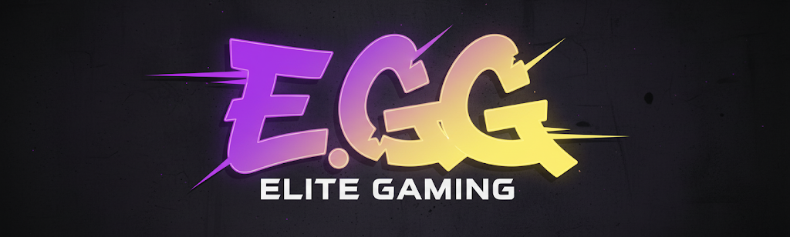
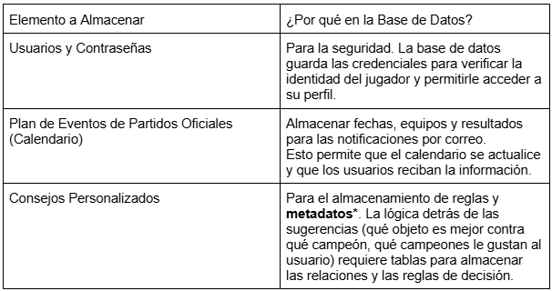
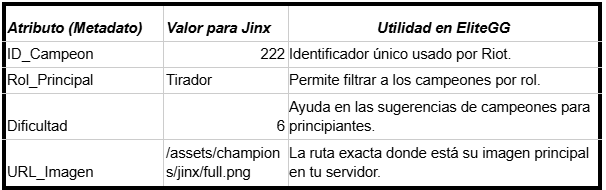
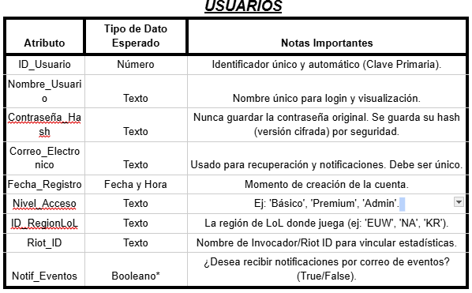
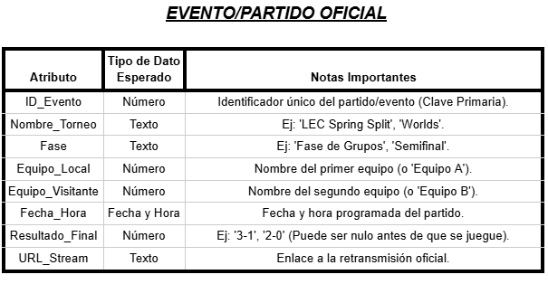
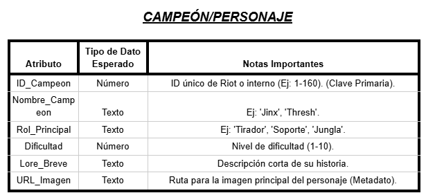
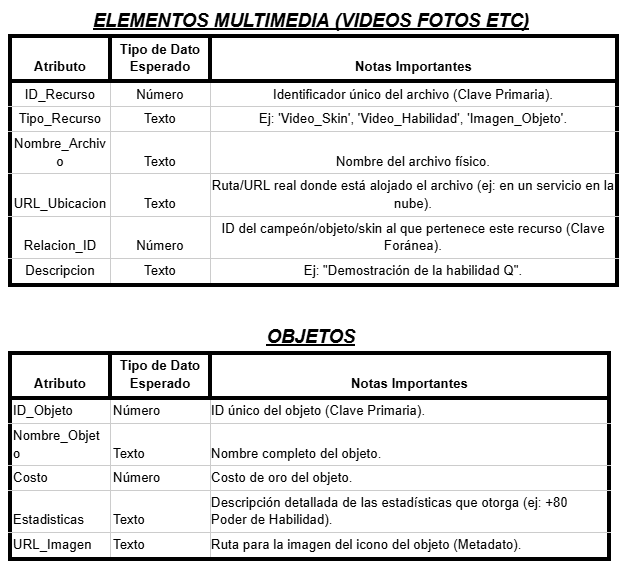
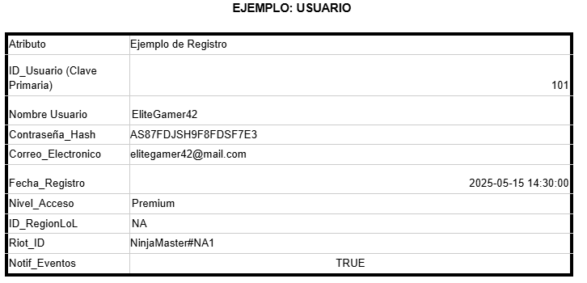
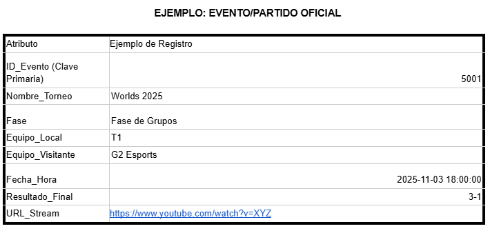
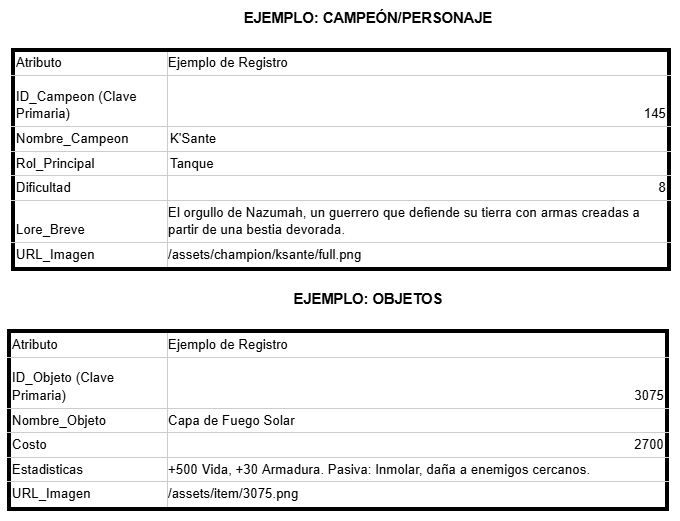

    <h1 style="text-align: center;">EliteGG</h1>

    <h2 style="text-align: center;">ÍNDICE</h2>

    <h2 style="text-align: center;">INTRODUCCIÓN</h2>

    EliteGG es una plataforma de análisis y seguimiento de estadísticas para distintos videojuegos, principalmente League of Legends, diseñada para jugadores que quieren mejorar y llevar un control más organizado de su progreso.
Nuestro objetivo es crear una página similar a OP.GG, pero con una interfaz más clara, ordenada y con nuevas herramientas exclusivas para la comunidad. 
      
    

    
<strong>¿Porque esta idea?</strong>

    

Como usuarios habituales de este tipo de páginas, creemos que sería interesante crear una que sea nuestra. Además, el tema nos apasiona, ya que trata de un videojuego que se disfruta en el tiempo libre. 
Otra razón importante es poder desarrollar una página que resuelva los fallos de las webs existentes en este ámbito. Al ser usuarios recurrentes de estos servicios, se ha identificado varias áreas de mejora y funcionalidades que serán muy útiles e interesantes para la comunidad.

<strong>¿Hasta donde quiero llegar con este proyecto?</strong>

El objetivo principal es crear una página que sea realmente util y consistente tanto a nivel tecnico como a nivel visual, para ello se ha analizado distintas páginas ya existentes y listado las funcionalidades que la pagina acabará conteniendo. Dichas funciones son: 
 1. Estadísticas personales detalladas: consultar historial de partidas, campeones más jugados y rendimiento por rol.... 
 2. Comparación con otros jugadores: medir tu nivel frente a amigos o rivales y descubrir en qué aspectos puedes mejorar. 
 3. Calendario de eventos: Accede a un calendario con torneos, eventos y novedades del juego para no perderte nada. También puedes guardar algún equipo en concreto como favorito para recibir un correo cada vez que este tenga un partido. 
 4. Consejos personalizados: Sugerencias de mejora basadas en tu estilo de juego y datos de la comunidad, como por ejemplo sugerencias de objetos según el campeón que quieras jugar y en contra de cuales juegues. También te hara una plantilla donde podras elegir que campeones te gusta jugar para darte consejos de que campeón de aquellos que te gustan deberías elegir en contra de enemigos concretos. 
 5. La pagina también va a incluir videos de una corta duración haciendo una demostración de las habilidades de los personajes y de sus diferentes aspectos. 

 
<strong>¿A quién va dirigido este proyecto?</strong>

 

 El proyecto está dirigido a la comunidad de League of Legends, un factor que nos beneficia mucho en términos de visibilidad. Al ser un juego para todos los públicos, el único "requisito" para usar nuestra plataforma es jugar al juego. Aunque mas adelante, si es posible, se incluiran más videojuegos ya que así el alcance podrá ser mayor y así abarcar otras comunidades.

 
<strong>Módulos del ciclo que tengan que ver con el proyecto</strong>

  

 En el proyecto se incluirán varios módulos del curso: 
1. Aplicaciones web: Este módulo es fundamental, ya que necesitamos desarrollar una página web funcional y atractiva. Para ello, utilizaremos lenguajes de programación como HTML y CSS. 
2. Seguridad: La seguridad es un aspecto crucial. Implementaremos medidas para proteger nuestros servidores y la información de los usuarios (como sus nombres y contraseñas) contra posibles ataques o robos de datos. 
3. Sistemas operativos en red: Este módulo se aplicará directamente en el uso de máquinas virtuales (MV) para nuestros servidores, lo cual es esencial para el despliegue del proyecto. 
4. Servicios en red: Este módulo será imprescindible, ya que utilizaremos herramientas esenciales como DNS para el funcionamiento de nuestra plataforma. 

<strong>Materiales necesarios:</strong>

<strong>Fisicos: </strong>
1. Ordenadores 
<strong>Lógicos: </strong>
1. Virtual Box (VM)  
2. Canva 
3. IA (Gemini) 
4. Visual Studio Code 
5. Vercel 
6. Trello 
7. Github 

<strong>Recursos (Bibliografía, webgrafía, vídeos, cursos o demás multimedia)</strong>

    

    https://www.youtube.com/watch?v=jkzq9j5yeT8&list=PL3vL1pnMCbUERqllcwhcvEJbKum-M9zT5
https://gist.github.com/dasdo/9ff71c5c0efa037441b6
https://www.youtube.com/watch?v=niPExbK8lSw&t=518s
 

    

    <h2 style="text-align: center;">BRIEFING DE IDEAS</h2>

    <h2 style="text-align: center;">ARQUITECTURA DEL SOFTWARE</h2>

    <h2 style="text-align: center;">TECNOLOGÍAS A UTILIZAR</h2>

    <h2 style="text-align: center;">RED</h2>

    <h2 style="text-align: center;">PLANIFICACIÓN DE BASE DATOS</h2>

<strong>Identificaciones de entidades principales</strong>

<strong>-¿Qué elementos importantes hay en tu web que necesitan almacenarse? </strong>
Usuarios y contraseñas, plan de eventos de los partidos oficiales, imagenes personajes, imágenes objetos, videos de las skins y habilidades (muchos videos), imagenes de cada juego para la primera página, y las recomendaciones que te da segun tu personaje

<strong>-¿Qué tema de información almacena? </strong>
Usuarios (con contraseñas), fechas, imagenes, videos.

<strong>-¿Por qué necesitas guardarla en la base de datos?</strong>

  

*Los metadatos son los datos extendidos sobre un primer dato, en esta tabla improvisada hemos puesto de ejemplo un campeón (Jinx) que en este caso sería el dato.
Todo lo que muestra la tabla serían los metadatos de este campeón.

  

<strong>Datos que se deben guardar de cada entidad (atributos)</strong>

Para cada entidad identificada en el punto anterior, describe qué información concreta se necesita guardar.
Por ejemplo, si una entidad es “Usuario”: 
1.Nombre 
2.Apellidos 
3.Correo electrónico 
4.Contraseña 
5.Fecha de registro 
<strong>-Indica el tipo de dato esperado (texto, número, fecha, etc.) y la definición que consideras que corresponde (varchar, int, decimal...)</strong> 

  

    <strong>*Booleano:</strong> Los datos booleanos son datos que se usan para conceptos positivos y negativos: 
Si/No 
Verdadero/Falso 
Afirmativo/negativo 

  

  

  

<strong>Relaciones entre tablas</strong>

    

        
<strong>1.USUARIOS y CAMPEÓN/PERSONAJE (Estadísticas y Progreso)</strong> 
Esta es la relación central para el análisis de estadísticas personales. 

<strong>2.USUARIOS y EVENTO/PARTIDO OFICIAL (Notificaciones y Favoritos)</strong> 
Esta relación permite al sistema enviar las notificaciones por correo de los partidos favoritos. 

<strong>3.CAMPEÓN/PERSONAJE y OBJETOS (Consejos Personalizados)</strong> 
Esta relación es fundamental para la funcionalidad de sugerencia de objetos e ítems contra campeones enemigos. 

<strong>4.CAMPEÓN/PERSONAJE u OBJETOS y ELEMENTOS MULTIMEDIA (Recursos)</strong> 
Esta relación vincula los archivos de medios (imágenes, vídeos de skins, videos de habilidades) con la entidad a la que pertenecen. 

<strong>Ejemplo de datos</strong>

    -Incluye un ejemplo de cada entidad con datos ficticios pero realistas. 
  

  
  
  

  
  
  

  
  

  

