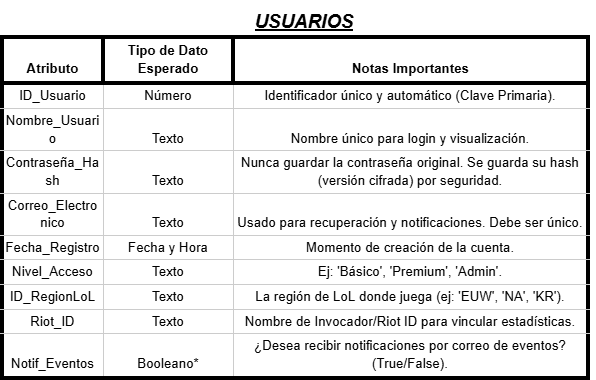
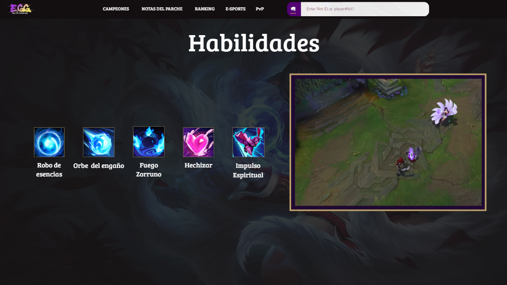

 

    <h1 style="text-align: center;">EliteGG</h1>

    <h2 style="text-align: center;">ÍNDICE</h2>

    <h2 style="text-align: center;">INTRODUCCIÓN</h2>

    EliteGG es una plataforma de análisis y seguimiento de estadísticas para distintos videojuegos, principalmente League of Legends, diseñada para jugadores que quieren mejorar y llevar un control más organizado de su progreso.
Nuestro objetivo es crear una página similar a OP.GG, pero con una interfaz más clara, ordenada y con nuevas herramientas exclusivas para la comunidad. 
      
    

    
<strong>¿POR QUÉ ESTA IDEA?</strong>

    

Como usuarios habituales de este tipo de páginas, creemos que sería interesante crear una que sea nuestra. Además, el tema nos apasiona, ya que trata de un videojuego que se disfruta en el tiempo libre. 
Otra razón importante es poder desarrollar una página que resuelva los fallos de las webs existentes en este ámbito. Al ser usuarios recurrentes de estos servicios, se ha identificado varias áreas de mejora y funcionalidades que serán muy útiles e interesantes para la comunidad.

<strong>¿HASTA DÓNDE QUIERO LLEGAR CON ESTE PROYECTO?</strong>

El objetivo principal es crear una página que sea realmente útil y consistente tanto a nivel técnico como a nivel visual, para ello se ha analizado distintas páginas ya existentes y listado las funcionalidades que la página acabará conteniendo. Dichas funciones son: 
<li>Estadísticas personales detalladas: consultar historial de partidas, campeones más jugados y rendimiento por rol... </li>
<li>Comparación con otros jugadores: medir tu nivel frente a amigos o rivales y descubrir en qué aspectos puedes mejorar. </li>
<li>Calendario de eventos: Accede a un calendario con torneos, eventos y novedades del juego para no perderte nada. También puedes guardar algún equipo en concreto como favorito para recibir un correo cada vez que este tenga un partido. </li>
<li>Consejos personalizados: Sugerencias de mejora basadas en tu estilo de juego y datos de la comunidad, como por ejemplo sugerencias de objetos según el campeón que quieras jugar y en contra de cuáles juegues. También te hará una plantilla donde podrás elegir qué campeones te gusta jugar para darte consejos de qué campeón de aquellos que te gustan deberías elegir en contra de enemigos concretos. </li>
<li>La página también va a incluir videos de una corta duración haciendo una demostración de las habilidades de los personajes y de sus diferentes aspectos. </li>

 
<strong>¿A QUIÉN VA DIRIGIDO ESTE PROYECTO?</strong>

 

El proyecto está dirigido a la comunidad de League of Legends, un factor que nos beneficia mucho en términos de visibilidad. Al ser un juego para todos los públicos, el único "requisito" para usar nuestra plataforma es jugar al juego. Aunque más adelante, si es posible, se incluirán más videojuegos, ya que así el alcance podrá ser mayor y así abarcar otras comunidades.

 
<strong>MÓDULOS DEL CICLO QUE TENGAN QUE VER CON EL PROYECTO</strong>

  

 En el proyecto se incluirán varios módulos del curso: 
<li>Aplicaciones web: Este módulo es fundamental, ya que necesitamos desarrollar una página web funcional y atractiva. Para ello, utilizaremos lenguajes de programación como HTML y CSS. </li>
<li>Seguridad: La seguridad es un aspecto crucial. Implementaremos medidas para proteger nuestros servidores y la información de los usuarios (como sus nombres y contraseñas) contra posibles ataques o robos de datos. </li>
<li>Sistemas operativos en red: Este módulo se aplicará directamente en el uso de máquinas virtuales (MV) para nuestros servidores, lo cual es esencial para el despliegue del proyecto. </li>
<li>Servicios en red: Este módulo será imprescindible, ya que utilizaremos herramientas esenciales como DNS para el funcionamiento de nuestra plataforma. </li>

<strong>MATERIALES NECESARIOS</strong>

<strong>FÍSICOS </strong>
<li>Ordenadores </li>                                                         
<strong>LÓGICOS </strong>
<li>Virtual Box (VM)  </li>
<li>Canva </li>
<li>Chatgpt </li>
<li>Deepseek </li>
<li>IA (Gemini) </li>
<li>Visual Studio Code </li>
<li>Vercel </li>
<li>Trello </li>
<li>Github </li>
<li>Corrector </li>
<li>Servicio DHCP en un servidor Windows diferente </li>
<li>Servidor DNS primario </li>
<li>Firewall: pfSense o Sophos </li>
<li>Backup: Truenas y/o rsync </li>
<li>Plan de contingencia </li>

    

    <h2 style="text-align: center;">INFORME DE BACKEND</h2>

<strong>IDENTIFICACIONES DE ENTIDADES PRINCIPALES</strong>

<strong>¿Qué elementos importantes hay en tu web que necesitan almacenarse? </strong>
Usuarios y contraseñas, plan de eventos de los partidos oficiales, imágenes personajes, imágenes objetos, videos de las skins y habilidades (muchos videos), imágenes de cada juego para la primera página, y las recomendaciones que te da según tu personaje.
  
<strong>¿Qué tema de información almacena? </strong>
Usuarios (con contraseñas), fechas, imágenes, videos.

  
<strong>¿Por qué necesitas guardarla en la base de datos?</strong> 
 Aquí tenemos una tabla donde se explica de manera resumida la razón por la cual hay que guardar cada tipo de dato.
      

  

<strong>*Los metadatos son los datos extendidos sobre un primer dato, en esta tabla improvisada hemos puesto de ejemplo un campeón (Jinx) que en este caso sería el dato.
Todo lo que muestra la tabla serían los metadatos de este campeón. </strong>
 Aquí tenemos un ejemplo de lo que serían los metadatos en un personaje aleatorio de nuestra página, en este caso jinx.
      

  

<strong>DATOS QUE SE DEBEN GUARDAR DE CADA ENTIDAD (ATRIBUTOS)</strong>

Para cada entidad identificada en el punto anterior, describe qué información concreta se necesita guardar.
Por ejemplo, si una entidad es “Usuario”: 
<li>Nombre</li>
<li>Apellidos</li>
<li>Correo electrónico</li>
<li>Contraseña</li>
<li>Fecha de registro</li>
      
<strong>Indica el tipo de dato esperado (texto, número, fecha, etc.) y la definición que consideras que corresponde (varchar, int, decimal...)</strong> 

  

    <strong>*Booleano:</strong> Los datos booleanos son datos que se usan para conceptos positivos y negativos 
Si/No 
Verdadero/Falso 
Afirmativo/negativo 

  

  

  

<strong>RELACIONES ENTRE TABLAS</strong>

    

        
<strong><li>USUARIOS y CAMPEÓN/PERSONAJE (Estadísticas y Progreso)</li></strong>
Esta es la relación central para el análisis de estadísticas personales. 

<strong><li>USUARIOS y EVENTO/PARTIDO OFICIAL (Notificaciones y Favoritos)</li></strong>
Esta relación permite al sistema enviar las notificaciones por correo de los partidos favoritos. 

<strong><li>CAMPEÓN/PERSONAJE y OBJETOS (Consejos Personalizados)</li></strong>
Esta relación es fundamental para la funcionalidad de sugerencia de objetos e ítems contra campeones enemigos. 

<strong><li>CAMPEÓN/PERSONAJE u OBJETOS y ELEMENTOS MULTIMEDIA (Recursos)</li></strong>
Esta relación vincula los archivos de medios (imágenes, vídeos de skins, videos de habilidades) con la entidad a la que pertenecen. 

<strong>EJEMPLOS DE DATOS</strong>

    Incluye un ejemplo de cada entidad con datos ficticios pero realistas. 
      
  

  
  
  

  
  
  

  
  

  

    <h2 style="text-align: center;">ARQUITECTURA DEL SOFTWARE</h2>

 
<strong>OBJETIVOS</strong>

  

 Estos són en formato lista los objetivos que tenemos con nuestra página: 
 <li>Desarrollar un sistema de registro/login seguro (intentaremos vincular el RIOT ID de los usuarios para poder verificar con más certeza quien accede a la página).</li>
   

 <li>Mostrar el historial de partidas, los campeones más jugados y el rendimiento por rol del usuario autenticado en una interfaz clara.</li>
    

          
    

   

 <li>Implementar la funcionalidad de Combos rápidos y explicación de las habilidades del mismo basada en el campeón que le gusta al usuario.</li>
   

  
             

  

  
             

   

 <li>Integrar un calendario de eventos oficiales de LoL con la capacidad de que los usuarios marquen equipos favoritos para recibir notificaciones por correo.</li>
       

  

   

 <li>Botón de PvP, sirve para poder seleccionar 2 cuentas diferentes y comparar diferentes aspectos de ambos jugadores mostrados en pantalla.</li>
       

  

    

 <li>Base de datos donde almacenemos los campeones actuales del juego con sus historias resumidas para los curiosos que les guste mirar más allá del juego.</li>
  

  

     

 Ranking de los mejores jugadores que se actualiza de manera automática, pudiendo entrar a los perfiles de esos jugadores TOP.
 

  

 
<strong>FUNCIONALIDADES</strong>

  

 Las funcionalidades de la página las se enseñaran en tabla dividiéndolas en ID, Prioridad, Explicación, Interacción, Estado.

  

 
<strong>RESPONSABLES DE TAREAS</strong>

 

 Cada miembro del equipo de trabajo se encargará de diferentes aspectos del proyecto, intentando aportar cada uno en el aspecto que más destaca.
 

  

 
<strong>CRONOGRAMA DE TAREAS</strong>

 

 Aquí se puede observar un cronograma para asignar fechas límite de cada tarea, indicando aproximaciones de cuando se debe o se debería tener acabada una tarea u objetivo en concreto.
 

  

 
<strong>DIVISIÓN DE CONTENEDORES LCX</strong>

 Un contenedor LXC (Linux Containers) es una tecnología de virtualización ligera a nivel de sistema operativo para entornos Linux. Para este proyecto se hará uso de esta tecnologia de esta manera:  
<strong><li>Máquina Virtual (VM 101)</li></strong>
 Gateway / Firewall (iptables) / DHCP (isc-dhcp-server).
 <strong><li>Contenedor de DNS (CT 105)</li></strong>
 Pi-hole (DNS + Bloqueador de anuncios)
<strong><li>Contenedor de Base de Datos (CT 107)</strong></li>
 MySQL (Base de Datos)
 <strong><li>Contenedor Backup (CT 108)</strong></li>
 NAS (Samba/NFS)

 
<strong>DATOS QUE SE VAN A SOLICITAR</strong>

  

 <strong>-Datos solicitados al usuario</strong>
<li>Riot ID (El cual ya está vinculado a un correo electrónico).</li>
<li>Nombre de usuario</li>
<li>Contraseña</li>
<li>Teléfono móvil</li>
<li>Correo electrónico</li>
<strong>-Tipos de usuarios</strong>
<li>Usuario sin cuenta: Este usuario solo tendrá acceso a la galería de campeones y sus derivados, pero no podrá ni guardar configuraciones ni equipos seleccionados ni recibir notificaciones de manera automática.</li>
<li>Usuario ya registrado: Este usuario ya puede tener tanto equipos favoritos, cuentas y campeones, además de tener la opción de tener notificaciones automáticas.</li>
<li>Administradores: Cuenta que solo tendremos los propietarios de la página para poder modificar pequeñas cosas de la base de datos.</li>
<strong>-Tipos de datos</strong>
 

  

 

  

  

  

 

  

  

  

  

  

   

  

    

  

    <h2 style="text-align: center;">TECNOLOGÍAS A UTILIZAR</h2>

El proyecto usará diferentes programas para poder ser funcional, las detallaremos en formato lista:
  

 
<strong>PROGRAMAS</strong>

 

 

 
<strong>DNS</strong>

 Traduce el nombre de dominio a la dirección IP del servidor donde se aloja la web, permitiendo a los usuarios encontrar la plataforma.

 
<strong>DHCP</strong>

No es esencial para la web pública, pero se usaría internamente en la red de desarrollo o producción para asignar IPs automáticas a los servidores y máquinas virtuales.

 
<strong>MYSQL</strong>

Es un sistema de gestión de bases de datos relacionales, para almacenar datos estructurados de Campeones, Objetos y Usuarios.

 
<strong>PIHOLE</strong>

Se usaría en la red de desarrollo para bloquear publicidad y rastreadores a nivel de red para un entorno de trabajo más limpio.

 
<strong>Vercel</strong>

Propio para el Frontend (React), ofreciendo un despliegue y alojamiento rápidos con caché global.

 
<strong>Github</strong>

Plataforma de control de versiones obligatoria donde se almacenará el código fuente del proyecto, gestionando ramas y la colaboración del equipo.

 
<strong>Firewall</strong>

Software de seguridad de red que protege el servidor, filtrando el tráfico malicioso y asegurando que solo los puertos necesarios (80, 443, 8080) estén accesibles.

 
<strong>APACHE</strong>

Puede usarse para servir el Frontend y gestionar el tráfico hacia el Backend.

 
<strong>NGINX</strong>

Gestiona y distribuye eficientemente las peticiones HTTP y sirve el contenido estático.

 

  
<strong>PHP</strong>

  Procesa y ejecuta el código dinámico de las aplicaciones para enviárselo a Nginx.

 
<strong>SO QUE VAMOS A UTILIZAR</strong>

 <li>Plataforma de Virtualización = Proxmox</li>
 <li>Servidor de Backup = NAS</li>
 <li>Servidores DNS = Debian</li>
 <li>Servidor de Aplicación/Web/DB = Debian</li>
 <li>Dhcp + Router = Debian + IP tables</li>
 <li>Máquinas de Desarrollo = Windows 11</li>
 

    <h2 style="text-align: center;">RED</h2>

    
<strong>DIAGRAMA DE LA RED</strong>

 Este es el plano de cómo va a estar estructurada la red del proyecto.
  

  

    
<strong>MAPA FÍSICO</strong>

 Aqui se puede observar las máquinas/hardware que va a utilizarse para el desarrollo de la web.
  

  

    <h2 style="text-align: center;">WEB</h2>

Aqui tendremos la planificación a nivel tanto visual como interactivo de lo que será nuestra web.

    
<strong>MOCKUP</strong>

    

Aquí se podrá observar las bases a nivel visual de lo que será la página web de EliteGG. Para empezar la paleta principal de colores que compone la página son el negro, blanco, morado y amarillo, esto para dar una sensación de estilo neon ya que la página está dirigida al gaming. Seguido esto tenemos cada apartado de la página.
      
    

    
<strong>Home page</strong>

     

      En nuestra Home page se encuentra primeramente una barra superior que contiene distintos objetos, comenzando por nuestro logo en un formato más pequeño y en la parte izquierda de la barra, seguido de "<strong>Campeones</strong>", "<strong>Notas del parche</strong>", "<strong>Ranking</strong>", "<strong>E-Sports</strong>", "<strong>PvP</strong>" y por último un buscador, y como se puede ver, estos últimos objetos se encuentran en la parte central de la barra superior, dicha barra superior se conservará en cualquier parte de la página. Seguido a esto, abajo tenemos el logo de "<strong>EliteGG</strong>" con un fondo del videojuego "<strong>League of Legends</strong>" y en su parte inferior otro buscador igual al anterior. Por último en la parte inferior tenemos un video decorativo del videojuego "League of Legends" que se reproduce de manera automática.
    

  
  

    
 
     

    
<strong>Galeria de campeones</strong>

         

        En nuestra galería de campeones se puede observar un filtro para de esta manera poder encontrar a cualquier campeón en concreto de manera más rápida y sin que el usuario pierda el tiempo de manera innecesaria, los campeones están presentados con un formato de tarjeta para que de esta forma se les pueda apreciar correctamente.
    

          
    

     

    

       
<strong>Perfil de Jugador</strong>

         

          En esta plantilla visual se puede observar el perfil de un jugador aleatorio, en dicho perfil se puede obtener distinta información, como puede ser su nivel de cuenta dentro del videojuego, cuánta gente ha visualizado su perfil, su rango, el historial de partidas, los roles que juega y las indicaciones de con cuánta frecuencia los juega junto al porcentaje de partidas que gana con cada rol y cuáles son los campeones que juega más.
    

          
    

    

     
<strong>PvP</strong>
  
         

       En <strong>"PvP"</strong> lo que ocurre es la comparación de cuentas de dos jugadores distintos, se deja de mostrar el historial de partidas y se comparan estadísticas en formato de porcentajes de ambos jugadores, de esta forma se puede analizar quien de los dos tiene un nivel más alto.
        

  

    

    

      
<strong>E-sports</strong>

         

             En la sección <strong>"E-sports"</strong> hay distintas funciones, cuándo el usuario accede a <strong>"E-sports"</strong> se le muestra en primer lugar una selección de las distintas ligas que hay en activo en este momento, una vez escoge la liga se le muestra un calendario con las fechas de los partidos que habrá en el futuro, junto a una lista general de todos los equipos, en esta parte de la página el usuario también tiene la opción de añadir un equipo como favorito, por último el usuario también puede acceder dentro de un equipo en concreto para ver la plantilla de jugadores con la que cuenta.
        

  

    

    

         
<strong>Campeón</strong>

         

         Este es el plano de lo que aparecerá una vez entremos a un campeón en concreto, habrá dos formas de hacerlo, ya sea buscando su nombre en las barras de búsqueda o en la galería de campeones, una vez entremos lo que podremos observar serán imágenes de los distintos aspectos de dicho campeón, acompañadas del su respectivo nombre y en un formato llamado "carrusel". Además haciendo scroll hacia abajo habrá distintos botones que te llevarán a las siguientes ubicaciones:  
        <strong>
        <li>Build </li>
        <li>Habilidades </li>
        <li>Matchups </li>
        <li>Fast Combos </li>
        <li>Parches </li></strong>
    Todo esto enfocado al personaje que hayamos escogido anteriormente. Por último si el usuario decide seguir scrolleando se encontrara con una sección especial de la historia del campeón.
         

  

    

    

          
<strong>Habilidades</strong>

         

       Este es el plano de uno de lo que se verá dentro del boton <strong>"Habilidades"</strong> anteriormente mencionado. Aqui se podrá observar todas las habilidades del campeón que hayamos seleccionado, acompañadas de un video demostrativo y una descripción de cada habilidad respectivamente.
         

  
             

    

      
 

          
<strong>Builds</strong>

         

                     Esto será lo primero que vea el usuario una vez entre al apartado de <b>"BUILD"</b>, aqui se muestran tres tipos de build entre las que el usuario podrá escoger la que mas le guste.
  

  
             
  
               Una vez escogida una build se te mostrara a detalle las <b>"Runas"</b> del tipo de build que el usuario haya escogido.         
    

  
             

   Después de las runas se mostrará una guia de los objetos que el usuario se debe comprar, junto al orden en el que lo debe hacer y el porcentaje de partidas que suelen ganar.
             

  
             
 
 

   

   
<strong>Matchups</strong>

         

   Esto es lo que verá el usuario una vez entre a la sección "Matchups" del campeón que haya escogido anteriormente, aqui se podrá observar que tan bueno es tu campeón en contra de otro en concreto, acompañado de una lista general de campeones que contrarrestan el tuyo, y que campeones son contrarrestados por tu personaje.       
  

  
             

   

   

   
<strong>Combos</strong>

     

      En este apartado de la página web el usuario podrá acceder a una lista de distintos combos del personaje que haya escogido anteriormente, cada combo tendra una serie de pasos y un video de demostración para llevarlo a cabo y que el usuario los pueda entender de manera clara, además los combos están divididos por dificultad.
 

  
             

             

             

    
<strong>MAPA DE NAVEGABILIDAD</strong>

 

 El mapa de navegabilidad de EliteGG está creado haciendo uso de la herramienta llamada "Miro". Aqui está el link para poder acceder a este: 
 <a href="https://miro.com/app/board/uXjVJ5uIMTM=/?share_link_id=5953744281"> <target=blank>Acceder al Mapa</a>. Este mapa tiene una estructura perfectamente pensada, los rombos representan la "Home page", los cuadrados morados representan botones/objetos interactuables, y los cuadrados amarillos representan aspectos puramente visuales. La estructura de la web está perfectamente interconectada unas funciones con otras, de esta manera el usuario puede llegar a cualquier parte de la web con la menor cantidad de clics posible.     

    <h2 style="text-align: center;">SERVICIOS</h2>

    
<strong>DNS</strong>

    
<strong>DHCP</strong>

    
<strong>APACHE</strong>

    
<strong>FIREWALL</strong>

    
<strong>COPIAS DE SEGURIDAD</strong>

    <h2 style="text-align: center;">CONCLUSIONES</h2>

    <h2 style="text-align: center;">BIBLIOGRAFIA</h2>

https://www.youtube.com/watch?v=jkzq9j5yeT8&list=PL3vL1pnMCbUERqllcwhcvEJbKum-M9zT5 
https://gist.github.com/dasdo/9ff71c5c0efa037441b6 
https://www.youtube.com/watch?v=niPExbK8lSw&t=518s 
https://gemini.google.com/app?hl=es 
https://tracker.gg/lol 
https://thetrackernetwork.com/home/tos 
https://www.leagueoflegends.com/es-es/champions/ 
https://soloqchallenge.gg/podio 
https://universe.leagueoflegends.com/es_ES/champions/ 
https://www.deepseek.com/ 
 

