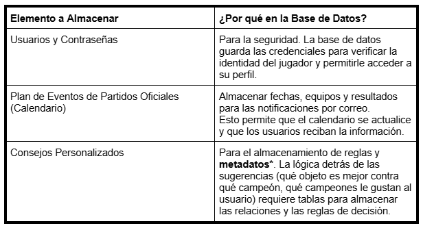
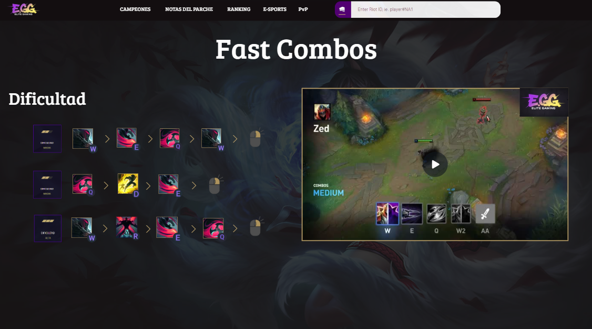

 

    <h1 style="text-align: center;">ELITEGG</h1>

    <h2 style="text-align: center;">ÍNDICE</h2>

    <h2 style="text-align: center;">INTRODUCCIÓN</h2>

    EliteGG es una plataforma de análisis y seguimiento de estadísticas para distintos videojuegos, principalmente League of Legends, diseñada para jugadores que quieren mejorar y llevar un control más organizado de su progreso.
El objetivo es crear una página similar a OP.GG, pero con una interfaz más clara, ordenada y con nuevas herramientas exclusivas para la comunidad. Los fundadores de este proyecto son:

    <h3 style="text-align: center;">THE ELITE</h3>

 

  
  

      
    

    
<strong>¿POR QUÉ ESTA IDEA?</strong>

    

Como usuarios habituales de este tipo de páginas, creemos que sería interesante crear una que sea nuestra. Además, el tema nos apasiona, ya que trata de un videojuego que se disfruta en el tiempo libre. 
Otra razón importante es poder desarrollar una página que resuelva los fallos de las webs existentes en este ámbito. Al ser usuarios recurrentes de estos servicios, se ha identificado varias áreas de mejora y funcionalidades que serán muy útiles e interesantes para la comunidad.

<strong>¿HASTA DÓNDE QUIERO LLEGAR CON ESTE PROYECTO?</strong>

El objetivo principal es crear una página que sea realmente útil y consistente tanto a nivel técnico como a nivel visual, para ello se ha analizado distintas páginas ya existentes y listado las funcionalidades que la página acabará conteniendo. Dichas funciones son: 
<li><strong>Estadísticas personales detalladas:</strong> consultar historial de partidas, campeones más jugados y rendimiento por rol... </li>
<li><strong>Comparación con otros jugadores:</strong> medir tu nivel frente a amigos o rivales y descubrir en qué aspectos puedes mejorar. </li>
<li><strong>Calendario de eventos:</strong> Accede a un calendario con torneos, eventos y novedades del juego para no perderte nada. También puedes guardar algún equipo en concreto como favorito para recibir un correo cada vez que este tenga un partido. </li>
<li><strong>Consejos personalizados:</strong> Sugerencias de mejora basadas en tu estilo de juego y datos de la comunidad, como por ejemplo sugerencias de objetos según el campeón que quieras jugar y en contra de cuáles juegues. También te hará una plantilla donde podrás elegir qué campeones te gusta jugar para darte consejos de qué campeón de aquellos que te gustan deberías elegir en contra de enemigos concretos. </li>
<li><strong>La página también va a incluir videos de una corta duración haciendo una demostración de las habilidades de los personajes y de sus diferentes aspectos.</strong> </li>

 
<strong>¿A QUIÉN VA DIRIGIDO ESTE PROYECTO?</strong>

 

El proyecto está dirigido a la comunidad de League of Legends, un factor que nos beneficia mucho en términos de visibilidad. Al ser un juego para todos los públicos, el único "requisito" para usar nuestra plataforma es jugar al juego. Aunque más adelante, si es posible, se incluirán más videojuegos, ya que así el alcance podrá ser mayor y así abarcar otras comunidades.

 
<strong>MÓDULOS DEL CICLO QUE TENGAN QUE VER CON EL PROYECTO</strong>

  

 En el proyecto se incluirán varios módulos del curso: 
<li>Aplicaciones web: Este módulo es fundamental, ya que necesitamos desarrollar una página web funcional y atractiva. Para ello, utilizaremos lenguajes de programación como HTML y CSS. </li>
<li>Seguridad: La seguridad es un aspecto crucial. Implementaremos medidas para proteger nuestros servidores y la información de los usuarios (como sus nombres y contraseñas) contra posibles ataques o robos de datos. </li>
<li>Sistemas operativos en red: Este módulo se aplicará directamente en el uso de máquinas virtuales (MV) para nuestros servidores, lo cual es esencial para el despliegue del proyecto. </li>
<li>Servicios en red: Este módulo será imprescindible, ya que utilizaremos herramientas esenciales como DNS para el funcionamiento de nuestra plataforma. </li>

<strong>MATERIALES NECESARIOS</strong>

<strong>FÍSICOS </strong>
<li>Ordenadores </li>                                                         
<strong>LÓGICOS </strong>
<li>Virtual Box (VM)  </li>
<li>Canva </li>
<li>Chatgpt </li>
<li>Deepseek </li>
<li>IA (Gemini) </li>
<li>Visual Studio Code </li>
<li>Vercel </li>
<li>Trello </li>
<li>Github </li>
<li>Corrector </li>
<li>Servicio DHCP en un servidor Windows diferente </li>
<li>Servidor DNS primario </li>
<li>Firewall: pfSense o Sophos </li>
<li>Backup: Truenas y/o rsync </li>
<li>Plan de contingencia </li>

    

    <h2 style="text-align: center;">INFORME DE BACKEND DE DB</h2>

<strong>IDENTIFICACIONES DE ENTIDADES PRINCIPALES</strong>

<strong>¿Qué elementos importantes hay en tu web que necesitan almacenarse? </strong>
Usuarios y contraseñas, plan de eventos de los partidos oficiales, imágenes personajes, imágenes objetos, videos de las skins y habilidades (muchos videos), imágenes de cada juego para la primera página, y las recomendaciones que te da según tu personaje.
  
<strong>¿Qué tema de información almacena? </strong>
Usuarios (con contraseñas), fechas, imágenes, videos.

  
<strong>¿Por qué necesitas guardarla en la base de datos?</strong> 
 Aquí tenemos una tabla donde se explica de manera resumida la razón por la cual hay que guardar cada tipo de dato.
      

  

<strong>*Los metadatos son los datos extendidos sobre un primer dato, en esta tabla improvisada hemos puesto de ejemplo un campeón (Jinx) que en este caso sería el dato.
Todo lo que muestra la tabla serían los metadatos de este campeón. </strong>
 Aquí tenemos un ejemplo de lo que serían los metadatos en un personaje aleatorio de nuestra página, en este caso jinx.
      

  

<strong>DATOS QUE SE DEBEN GUARDAR DE CADA ENTIDAD (ATRIBUTOS)</strong>

Para cada entidad identificada en el punto anterior, describe qué información concreta se necesita guardar.
Por ejemplo, si una entidad es “Usuario”: 
<li>Nombre</li>
<li>Apellidos</li>
<li>Correo electrónico</li>
<li>Contraseña</li>
<li>Fecha de registro</li>
      
<strong>Indica el tipo de dato esperado (texto, número, fecha, etc.) y la definición que consideras que corresponde (varchar, int, decimal...)</strong> 

  

    <strong>*Booleano:</strong> Los datos booleanos son datos que se usan para conceptos positivos y negativos 
Si/No 
Verdadero/Falso 
Afirmativo/negativo 

  

  

  

<strong>RELACIONES ENTRE TABLAS</strong>

    

        
<strong><li>USUARIOS y CAMPEÓN/PERSONAJE (Estadísticas y Progreso)</li></strong>
Esta es la relación central para el análisis de estadísticas personales. 

<strong><li>USUARIOS y EVENTO/PARTIDO OFICIAL (Notificaciones y Favoritos)</li></strong>
Esta relación permite al sistema enviar las notificaciones por correo de los partidos favoritos. 

<strong><li>CAMPEÓN/PERSONAJE y OBJETOS (Consejos Personalizados)</li></strong>
Esta relación es fundamental para la funcionalidad de sugerencia de objetos e ítems contra campeones enemigos. 

<strong><li>CAMPEÓN/PERSONAJE u OBJETOS y ELEMENTOS MULTIMEDIA (Recursos)</li></strong>
Esta relación vincula los archivos de medios (imágenes, vídeos de skins, videos de habilidades) con la entidad a la que pertenecen. 

<strong>EJEMPLOS DE DATOS</strong>

    Incluye un ejemplo de cada entidad con datos ficticios pero realistas. 
      
  

  
  
  

  
  
  

  
  

 

  

<strong>LISTA DE DATOS DB</strong>

  

  

   
<strong>USUARIOS</strong>

   

   <li>Riot ID</li>
   <li>Contraseña</li>
   <li>Correo</li>
   <li>Teléfono</li>
   <li>Fecha de registro</li>
  

  

<strong>CAMPEONES</strong>

   <li>ID Campeón</li>
   <li>Nombre del campeón</li>
   <li>Apodo</li>
   <li>Rol principal</li>
   <li>Clase</li>
   <li>Lore del campeón</li>
   <li>Estadísticas del campeón nvl 1</li>
   <li>Imagen del campeón</li>
   <li>Habilidades</li>
   <li>Combos</li>
   <li>Skins</li>
   <li>Precio</li>
  

   

    
<strong>BUILDS</strong>

    <li>ID Build</li>
    <li>Runas</li>
    <li>Items</li>
   

  

    
<strong>ITEMS</strong>

   <li>ID de Item</li>
   <li>Nombre de items</li>
   <li>Precio de Items</li>
   <li>Venta de Item</li>
   <li>Estadísticas de item</li>
   <li>Imagen de Item</li>
   <li>Activación</li>
   <li>Pasiva</li>
   <li>Lore de Item</li>
   <li>Rama de Creación</li> 
  

   

       
<strong>RUNAS</strong>

    <li>ID Runa</li>
    <li>Runa Padre</li>
    <li>Runa Secundaria</li>
    <li>Estadísticas adicionales</li>
   

   

       
<strong>E-SPORTS</strong>

    
    <li>Equipos</li>
    <li>Ligas</li>
    <li>Jugadores</li>
   

     

       
<strong>EQUIPOS</strong>

   
    <li>ID Equipo</li>
    <li>Nombre del Equipo</li>
    <li>Foto del Equipo</li>
    <li>Jugadores del equipo</li>
    <li>Logros del equipo</li>
    <li>Historia del equipo</li>
    <li>Redes sociales del equipo</li>
    <li>Calendario de equipo</li>
     

        

       
<strong>JUGADORES</strong>

   
    <li>ID Jugador</li>
    <li>Nombre del equipo</li>
    <li>Foto del jugador</li>
    <li>Rol del jugador</li>
    <li>Trayectoria del jugador</li>
    <li>Premios del jugador</li>
    <li>Redes sociales del jugador</li>
    <li>Campeón preferido (provisional)</li>
        

         

       
<strong>LIGAS</strong>

 
    <li>ID liga</li>
    <li>Nombre de la liga</li>
    <li>Foto de la liga</li>
    <li>Equipos</li>
    <li>Región</li>
         

        
 
   

<strong>RELACIONES DB</strong>

 
 
 Aqui se podra observar las relaciones que habrá entre las distintas tablas de la base de datos, junto a las claves foráneas y Claves Primarias de cada una de ellas. Esta está creada utilizando la plataforma MYSQL Workbench.
    

          
    

    <h2 style="text-align: center;">ARQUITECTURA DEL SOFTWARE</h2>

 
<strong>OBJETIVOS</strong>

  

 Estos són en formato lista los objetivos que tenemos con nuestra página: 
 <li>Desarrollar un sistema de registro/login seguro (intentaremos vincular el RIOT ID de los usuarios para poder verificar con más certeza quien accede a la página).</li>
   

 <li>Mostrar el historial de partidas, los campeones más jugados y el rendimiento por rol del usuario autenticado en una interfaz clara.</li>
    

          
    

   

 <li>Implementar la funcionalidad de Combos rápidos y explicación de las habilidades del mismo basada en el campeón que le gusta al usuario.</li>
   

  
             

  

  
             

   

 <li>Integrar un calendario de eventos oficiales de LoL con la capacidad de que los usuarios marquen equipos favoritos para recibir notificaciones por correo.</li>
       

  

   

 <li>Botón de PvP, sirve para poder seleccionar 2 cuentas diferentes y comparar diferentes aspectos de ambos jugadores mostrados en pantalla.</li>
       

  

    

 <li>Base de datos donde almacenemos los campeones actuales del juego con sus historias resumidas para los curiosos que les guste mirar más allá del juego.</li>
  

  

     

 Ranking de los mejores jugadores que se actualiza de manera automática, pudiendo entrar a los perfiles de esos jugadores TOP.
 

  

 
<strong>FUNCIONALIDADES</strong>

  

 Las funcionalidades de la página las se enseñaran en tabla dividiéndolas en ID, Prioridad, Explicación, Interacción, Estado.

  

 
<strong>RESPONSABLES DE TAREAS</strong>

 

 Cada miembro del equipo de trabajo se encargará de diferentes aspectos del proyecto, intentando aportar cada uno en el aspecto que más destaca.
 

  

 
<strong>CRONOGRAMA DE TAREAS</strong>

 

 Aqui tenemos un diagrama de gantt, hecho con Excel y que indica de manera precisa y extensa los tiempos de nuestros objetivos a completar.
 <a href="https://docs.google.com/spreadsheets/d/1vdO17U3JqT5LDkLZkZSWqC-pszDx7UJ8b-GnVSr70g0/edit?usp=sharing"> <target=blank>Acceder al Excel</a>

 
<strong>DIVISIÓN DE CONTENEDORES LCX</strong>

 Un contenedor LXC (Linux Containers) es una tecnología de virtualización ligera a nivel de sistema operativo para entornos Linux. Para este proyecto se hará uso de esta tecnologia de esta manera:  
<strong><li>Máquina Virtual (VM 101)</li></strong>
 Gateway / Firewall (iptables) / DHCP (isc-dhcp-server).
 <strong><li>Contenedor de DNS (CT 105)</li></strong>
 Pi-hole (DNS + Bloqueador de anuncios)
<strong><li>Contenedor de Base de Datos (CT 107)</strong></li>
 MySQL (Base de Datos)
 <strong><li>Contenedor Backup (CT 108)</strong></li>
 NAS (Samba/NFS)

 
<strong>DATOS QUE SE VAN A SOLICITAR</strong>

  

 <strong>-Datos solicitados al usuario</strong>
<li>Riot ID (El cual ya está vinculado a un correo electrónico).</li>
<li>Nombre de usuario</li>
<li>Contraseña</li>
<li>Teléfono móvil</li>
<li>Correo electrónico</li>
<strong>-Tipos de usuarios</strong>
<li>Usuario sin cuenta: Este usuario solo tendrá acceso a la galería de campeones y sus derivados, pero no podrá ni guardar configuraciones ni equipos seleccionados ni recibir notificaciones de manera automática.</li>
<li>Usuario ya registrado: Este usuario ya puede tener tanto equipos favoritos, cuentas y campeones, además de tener la opción de tener notificaciones automáticas.</li>
<li>Administradores: Cuenta que solo tendremos los propietarios de la página para poder modificar pequeñas cosas de la base de datos.</li>
<strong>-Tipos de datos</strong>
 

  

 

  

  

  

 

  

  

  

  

  

   

  

    

  

 

  

 <strong>DEFINICIONES DE LO QUE QUEREMOS USAR:</strong>
 <li><strong>Varchar (X):</strong> Este tipo de dato está hecho para carácter variables, lo que habrá entre  los paréntesis será el número máximo de bits que podremos usar, por ejemplo, si lo que tengo que sacar es un “hola” solo usará 4 bits, sin desperdiciar el resto.</li>
 <li><strong>ENUM:</strong> ENUM se utiliza para un campo donde solo se permite uno de un conjunto predefinido de valores.
Todo valor que no esté dentro de esa lista predefinida, se devolverá.</li>
 <li><strong>Text:</strong> Formato de texto libre. </li>
 <li><strong>Int o Bigint:</strong> Números enteros sin decimales.</li>
 <li><strong>DATETIME:</strong> Para registrar un momento exacto, incluyendo tanto la fecha como la hora.</li>
 <li><strong>JSON (JavaScript Object Notation):</strong> Se usa para almacenar datos complejos y semi-estructurados, como listas anidadas o pares clave-valor.</li>

    <h2 style="text-align: center;">TECNOLOGÍAS A UTILIZAR</h2>

El proyecto usará diferentes programas para poder ser funcional, las detallaremos en formato lista:
  

 
<strong>PROGRAMAS</strong>

 

 

 
<strong>DNS</strong>

 Traduce el nombre de dominio a la dirección IP del servidor donde se aloja la web, permitiendo a los usuarios encontrar la plataforma.

 
<strong>DHCP</strong>

No es esencial para la web pública, pero se usaría internamente en la red de desarrollo o producción para asignar IPs automáticas a los servidores y máquinas virtuales.

 
<strong>MYSQL</strong>

Es un sistema de gestión de bases de datos relacionales, para almacenar datos estructurados de Campeones, Objetos y Usuarios.

 
<strong>PIHOLE</strong>

Se usaría en la red de desarrollo para bloquear publicidad y rastreadores a nivel de red para un entorno de trabajo más limpio.

 
<strong>Vercel</strong>

Propio para el Frontend (React), ofreciendo un despliegue y alojamiento rápidos con caché global.

 
<strong>Github</strong>

Plataforma de control de versiones obligatoria donde se almacenará el código fuente del proyecto, gestionando ramas y la colaboración del equipo.

 
<strong>Firewall</strong>

Software de seguridad de red que protege el servidor, filtrando el tráfico malicioso y asegurando que solo los puertos necesarios (80, 443, 8080) estén accesibles.

 
<strong>APACHE</strong>

Puede usarse para servir el Frontend y gestionar el tráfico hacia el Backend.

 
<strong>NGINX</strong>

Gestiona y distribuye eficientemente las peticiones HTTP y sirve el contenido estático.

 

  
<strong>PHP</strong>

  Procesa y ejecuta el código dinámico de las aplicaciones para enviárselo a Nginx.

 
<strong>SO QUE VAMOS A UTILIZAR</strong>

 <li>Plataforma de Virtualización = Proxmox</li>
 <li>Servidor de Backup = Debian</li>
 <li>Servidores DNS = Debian</li>
 <li>Servidor de Aplicación/Web/DB = Debian</li>
 <li>Dhcp + Router = Debian (interfaz gráfica) + IP tables</li>
 <li>Máquinas de Desarrollo = Windows 11</li>
 

    <h2 style="text-align: center;">RED</h2>

    
<strong>DIAGRAMA DE LA RED</strong>

 Este es el plano de cómo va a estar estructurada la red del proyecto.
  

  

    <h2 style="text-align: center;">WEB</h2>

Aqui tendremos la planificación a nivel tanto visual como interactivo de lo que será nuestra web.

    
<strong>MOCKUP</strong>

    

Aquí se podrá observar las bases a nivel visual de lo que será la página web de EliteGG. Para empezar la paleta principal de colores que compone la página son el negro, blanco, morado y amarillo, esto para dar una sensación de estilo neon ya que la página está dirigida al gaming. Seguido esto tenemos cada apartado de la página.
      
    

    
<strong>Home page</strong>

     

      En nuestra Home page se encuentra primeramente una barra superior que contiene distintos objetos, comenzando por nuestro logo en un formato más pequeño y en la parte izquierda de la barra, seguido de "<strong>Campeones</strong>", "<strong>Notas del parche</strong>", "<strong>Ranking</strong>", "<strong>E-Sports</strong>", "<strong>PvP</strong>" y por último un buscador, y como se puede ver, estos últimos objetos se encuentran en la parte central de la barra superior, dicha barra superior se conservará en cualquier parte de la página. Seguido a esto, abajo tenemos el logo de "<strong>EliteGG</strong>" con un fondo del videojuego "<strong>League of Legends</strong>" y en su parte inferior otro buscador igual al anterior. Por último en la parte inferior tenemos un video decorativo del videojuego "League of Legends" que se reproduce de manera automática.
    

  
  

    
 
     

    
<strong>Galeria de campeones</strong>

         

        En nuestra galería de campeones se puede observar un filtro para de esta manera poder encontrar a cualquier campeón en concreto de manera más rápida y sin que el usuario pierda el tiempo de manera innecesaria, los campeones están presentados con un formato de tarjeta para que de esta forma se les pueda apreciar correctamente.
    

          
    

     

    

       
<strong>Perfil de Jugador</strong>

         

          En esta plantilla visual se puede observar el perfil de un jugador aleatorio, en dicho perfil se puede obtener distinta información, como puede ser su nivel de cuenta dentro del videojuego, cuánta gente ha visualizado su perfil, su rango, el historial de partidas, los roles que juega y las indicaciones de con cuánta frecuencia los juega junto al porcentaje de partidas que gana con cada rol y cuáles son los campeones que juega más.
    

          
    

    

     
<strong>PvP</strong>
  
         

       En <strong>"PvP"</strong> lo que ocurre es la comparación de cuentas de dos jugadores distintos, se deja de mostrar el historial de partidas y se comparan estadísticas en formato de porcentajes de ambos jugadores, de esta forma se puede analizar quien de los dos tiene un nivel más alto.
        

  

    

    

      
<strong>E-sports</strong>

         

             En la sección <strong>"E-sports"</strong> hay distintas funciones, cuándo el usuario accede a <strong>"E-sports"</strong> se le muestra en primer lugar una selección de las distintas ligas que hay en activo en este momento, una vez escoge la liga se le muestra un calendario con las fechas de los partidos que habrá en el futuro, junto a una lista general de todos los equipos, en esta parte de la página el usuario también tiene la opción de añadir un equipo como favorito, por último el usuario también puede acceder dentro de un equipo en concreto para ver la plantilla de jugadores con la que cuenta.
        

  

    

    

         
<strong>Campeón</strong>

         

         Este es el plano de lo que aparecerá una vez entremos a un campeón en concreto, habrá dos formas de hacerlo, ya sea buscando su nombre en las barras de búsqueda o en la galería de campeones, una vez entremos lo que podremos observar serán imágenes de los distintos aspectos de dicho campeón, acompañadas del su respectivo nombre y en un formato llamado "carrusel". Además haciendo scroll hacia abajo habrá distintos botones que te llevarán a las siguientes ubicaciones:  
        <strong>
        <li>Build </li>
        <li>Habilidades </li>
        <li>Matchups </li>
        <li>Fast Combos </li>
        <li>Parches </li></strong>
    Todo esto enfocado al personaje que hayamos escogido anteriormente. Por último si el usuario decide seguir scrolleando se encontrara con una sección especial de la historia del campeón.
         

  

    

    

          
<strong>Habilidades</strong>

         

       Este es el plano de uno de lo que se verá dentro del boton <strong>"Habilidades"</strong> anteriormente mencionado. Aqui se podrá observar todas las habilidades del campeón que hayamos seleccionado, acompañadas de un video demostrativo y una descripción de cada habilidad respectivamente.
         

  
             

    

      
 

          
<strong>Builds</strong>

         

                     Esto será lo primero que vea el usuario una vez entre al apartado de <b>"BUILD"</b>, aqui se muestran tres tipos de build entre las que el usuario podrá escoger la que mas le guste.
  

  
             
  
               Una vez escogida una build se te mostrara a detalle las <b>"Runas"</b> del tipo de build que el usuario haya escogido.         
    

  
             

   Después de las runas se mostrará una guia de los objetos que el usuario se debe comprar, junto al orden en el que lo debe hacer y el porcentaje de partidas que suelen ganar.
             

  
             
 
 

   

   
<strong>Matchups</strong>

         

   Esto es lo que verá el usuario una vez entre a la sección "Matchups" del campeón que haya escogido anteriormente, aqui se podrá observar que tan bueno es tu campeón en contra de otro en concreto, acompañado de una lista general de campeones que contrarrestan el tuyo, y que campeones son contrarrestados por tu personaje.       
  

  
             

   

   

   
<strong>Combos</strong>

     

      En este apartado de la página web el usuario podrá acceder a una lista de distintos combos del personaje que haya escogido anteriormente, cada combo tendra una serie de pasos y un video de demostración para llevarlo a cabo y que el usuario los pueda entender de manera clara, además los combos están divididos por dificultad.
 

  
             

             

             

    
<strong>MAPA DE NAVEGABILIDAD</strong>

 

 El mapa de navegabilidad de EliteGG está creado haciendo uso de la herramienta llamada "Miro". Aqui está el link para poder acceder a este: 
 <a href="https://miro.com/app/board/uXjVJ5uIMTM=/?share_link_id=5953744281"> <target=blank>Acceder al Mapa</a>. Este mapa tiene una estructura perfectamente pensada, los rombos representan la "Home page", los cuadrados morados representan botones/objetos interactuables, y los cuadrados amarillos representan aspectos puramente visuales. La estructura de la web está perfectamente interconectada unas funciones con otras, de esta manera el usuario puede llegar a cualquier parte de la web con la menor cantidad de clics posible.     

    <h2 style="text-align: center;">SERVICIOS</h2>

  
<strong>SERVIDOR DNS Y FILTRADO (PI-HOLE)</strong>

  

  
  
<strong>Configuración del Sistema:</strong>

  <ul>
    <li><strong>S.O:</strong> Debian / Linux (Contenedor LXC)</li>
    <li><strong>IP:</strong> <code>10.10.10.5/24</code></li>
    <li><strong>Función:</strong> Resolución DNS interna y bloqueo de publicidad/telemetría.</li>
  </ul>

  
<strong>¿Qué hemos hecho?</strong> 
  Instalamos y configuramos <strong>Pi-hole</strong> como el "vigilante" de la red. Cada vez que una máquina (como el servidor Web o tu PC) intenta acceder a una URL, Pi-hole filtra si es legítima o publicidad/rastreo, bloqueándola en el origen. Además, configuramos el <strong>Port Forwarding</strong> en el Router (Puerto 80) hacia la <code>10.10.10.5</code> para gestionar el panel <code>/admin/</code> de forma remota.

  
<strong>Comandos principales:</strong>

  
  
<code>curl -sSL https://install.pi-hole.net | bash</code> 
  <small>Instalación automatizada y configuración de IP estática y upstream DNS.</small>

  
<code>pihole -a -p</code> 
  <small>Cambio de contraseña del panel administrativo web (Seguridad para la red EliteGG).</small>

  
<code>pihole -g</code> y <code>pihole status</code> 
  <small>Actualización de listas de bloqueo (Gravity) y verificación del estado del servicio DNS.</small>

  
<strong>ROUTER (GATEWAY DE RED)</strong>

  

  
  
<strong>Configuración del Sistema:</strong>

  <ul>
    <li><strong>S.O:</strong> Debian (Interfaz Gráfica) en Proxmox</li>
    <li><strong>IP LAN:</strong> <code>10.10.10.1/24</code></li>
    <li><strong>Interfaces:</strong> 2 adaptadores (Bridge WAN y Red Interna LAN)</li>
    <li><strong>Función:</strong> Gestión de tráfico y NAT entre redes.</li>
  </ul>

  
<strong>¿Qué hemos hecho?</strong> 
  Configuramos una MV con doble interfaz para unir la red de IFP con nuestra red interna <code>10.10.10.0/24</code>. Utilizamos <strong>iptables</strong> para gestionar el flujo de paquetes y permitir que los contenedores tengan salida a internet mediante NAT. Validamos la conectividad constantemente con <code>ping 8.8.8.8</code>.

  

  
<strong>Comandos principales:</strong>

  
  
<code>echo 1 > /proc/sys/net/ipv4/ip_forward</code> 
  <small>Activa el reenvío de paquetes a nivel de Kernel, transformando la MV en un router real.</small>

  
<code>iptables -t nat -A POSTROUTING -o ens18 -j MASQUERADE</code> 
  <small>Configura el <strong>Masquerade</strong>: permite que los contenedores "se disfracen" con la IP del router para navegar por internet.</small>

  
<code>iptables-save > /etc/iptables/rules.v4</code> 
  <small>Asegura la persistencia de las reglas mediante <code>iptables-persistent</code> para que no se borren tras un reinicio.</small>

    
<strong>Servidor web</strong>

    
<strong>Servidor database</strong>

    
<strong>Servidor Backups</strong>

    <h2 style="text-align: center;">CONCLUSIONES</h2>

    <h2 style="text-align: center;">BIBLIOGRAFIA</h2>

https://www.youtube.com/watch?v=jkzq9j5yeT8&list=PL3vL1pnMCbUERqllcwhcvEJbKum-M9zT5 
https://gist.github.com/dasdo/9ff71c5c0efa037441b6 
https://www.youtube.com/watch?v=niPExbK8lSw&t=518s 
https://gemini.google.com/app?hl=es 
https://tracker.gg/lol 
https://thetrackernetwork.com/home/tos 
https://www.leagueoflegends.com/es-es/champions/ 
https://soloqchallenge.gg/podio 
https://universe.leagueoflegends.com/es_ES/champions/ 
https://www.deepseek.com/ 
 

 

    <h1 style="text-align: center;">ACERO IMPURO</h1>

    <h2 style="text-align: center;">¿Qué es Arduino?</h2>

Un arduino se compone de dos partes principales, la física y digital.

 
<strong>Física</strong>

  

 La física se compone de una placa la cual puedes modificar o manejar a tu gusto
  

  
             

 
<strong>Digital</strong>

  

 La parte digital es la parte donde puedes escribir un código para darle una serie de instrucciones y así hacer que el Arduino tenga la función que tu quieras.
  

  
             

    <h2 style="text-align: center;">¿Cuál es su origen?</h2>

Arduino nació en 2005 en el Instituto de Diseño Interactivo de Ivrea, Italia. Fue creado por un equipo liderado por Massimo Banzi.
  

  
             

Su idea era ofrecer a los estudiantes una herramienta de proyectos electrónica que fuera sencilla, de bajo coste y rápida de aprender. Tras el cierre del instituto, el proyecto se liberó, impulsando su fama.

    <h2 style="text-align: center;">¿Cuáles son sus características mas importantes?</h2>

Arduino es de código abierto (hardware y software libres), los dos factores mas importantes son: 
<strong><li>Creatividad</li></strong>
La creatividad. Destaca por su flexibilidad para adaptarse y su facilidad de uso, ideal para principiantes gracias a un lenguaje de programación simple. 
<strong><li>Bajo coste</li></strong>
Su bajo coste lo hace accesible, y cuenta con una gran comunidad global que ofrece

    <h2 style="text-align: center;">¿Qué modelos hay?</h2>

Existen diversos modelos de Arduino, como el Uno, Mega, Nano y Leonardo. Cada uno varía en sus piezas, el voltaje que usa (generalmente 5V), y la cantidad de pines digitales y entradas analógicas. También se diferencian en la capacidad de memoria (Flash, SRAM, EEPROM) y la velocidad del reloj. Estas diferencias los hacen adecuados para distintos tipos y dificultades de proyectos.
  

  
             

    <h2 style="text-align: center;">¿Para qué sirve?</h2>

 Arduino sirve para crear una gran cantidad de proyectos electrónicos y de robótica. Suele usarse para escuelas donde se enseña programación y donde se hacen trabajos básicos de robótica.
 <strong><li>Sistemas para casas</li></strong>
 Controla sensores y actuadores en sistemas interactivos.
   

  
             

  <strong><li>Edificios automáticos</li></strong>
  Controla sensores y actuadores en sistemas interactivos.
     

  
             

    <h2 style="text-align: center;">¿Qué lenguaje utiliza?</h2>

Arduino se programa utilizando un lenguaje propio, el “C”, que a su vez está basado en C++.
   

  
             

es una versión simplificada, con funciones específicas para interactuar fácilmente con las placas del Arduino. Este lenguaje de programación mantiene una curva de aprendizaje más accesible para los principiantes.

    <h2 style="text-align: center;">¿Qué es el IDE?</h2>

El Arduino IDE es el Entorno de Desarrollo Integrado oficial y gratuito.
 

  
             

    <h2 style="text-align: center;">ACTIVIDAD 0 BLINK</h2>

Objetivo: Utilizaremos el ESP32-S3 WROOM para controlar el parpadeo de un LED común 
<strong>Lista de componentes:</strong>
   

  
             

El ESP32-S3 WROOM necesita una corriente de 5v, aunque en esta actividad lo vamos a conectar directamente al PC vía el cable USB. 

<strong>Buscar en el manual de referencia la información del led azul que parpadea.</strong>

Es un codigo que hace que un LED parpadee de forma repetida. Esto es para indicar que la placa y el software funcionan correctamente.

<strong>¿Qué son el void setup() and void loop() ?</strong>

<li>El void setup() es para decirle al arduino cómo debe comportarse, dentro de esto estan los pines o la comunicación con el PC</li>
<li>El void loop() se centra en hacer cosas como leer sensores o controlar motores, es básicamente la parte que se debe ejecutar una y otra vez de manera infinita.</li>

<strong>¿Qué quiere decir la línea: #define LED_BUITIN 2 ?</strong>

 

Es un LED que viene soldado a la placa Arduino, casi siempre el pin 13, su uso es comprobar que el codigo funciona.

<strong>¿Qué quiere decir la línea delay(1000); ?</strong>

 

Le dice al Arduino que se detenga y no haga absolutamente nada durante el tiempo especificado, el numero se mide siempre en milisegundos, en este caso al ser 1000 es un segundo de espera.

    <h2 style="text-align: center;">ACTIVIDAD 1 LED</h2>

Ahora es que realmente vamos a comenzar a construir y explorar algunos proyectos basados en el chip ESP32-S3
WROOM. Utilizaremos para ello, nuestro chip para controlar el parpadeo de un LED común.

<strong>Lista de componentes:</strong>
   

  
             

Vamos a construir nuestro circuito según se muestra en el diagrama. Solo después de construirlo es que podemos conectarlo al PC para verificar que es correcto.

  
             
  
             

  
             
  
Aqui esta el codigo que se usa para el Arduino
            

  
             
 
             

  
             
 
                         

  
             
 
Aqui se puede observar el LED parpadeando y esperando 1 segundo

https://github.com/user-attachments/assets/49e49177-718f-447d-90b8-2797805de5da

    <h2 style="text-align: center;">ACTIVIDAD 2 SEMÁFORO</h2>

Componentes necesarios:
   

  
             

             Aqui esta el codigo de este ejercicio, en dicho código lo que le estamos ordenando a nuestro arduino es que debe encender las tres luces que le hemos puesto siguiendo el patrón de un semáforo.
   

  
             

             Aqui se puede ver el esquema del circuito de dicho semáforo
  

  
             

https://github.com/user-attachments/assets/5c37b494-c140-4cbd-9c3f-217365d051c2

    <h2 style="text-align: center;">ACTIVIDAD 3 BUTTON & LED</h2>

Componentes necesarios:
   

  
             

             Aqui esta el codigo de este ejercicio, en dicho código lo que le estamos ordenando a nuestro arduino es que debe encender la luz cuando pulsemos el botón
   

  
             

             Aqui se puede ver el esquema del circuito de dicho arduino
  

  
             

https://github.com/user-attachments/assets/34f02e2f-5f67-45fd-9deb-352e842ec188

    <h2 style="text-align: center;">ACTIVIDAD 4  MINI TABLE LAMP</h2>

Componentes necesarios:
   

  
             

Para esta práctica también usaremos un interruptor de botón, un LED para hacer una lámpara de mesa MINI, pero de manera diferente, esto es: al presionar el botón, el LED se encenderá y, al presionar el botón nuevamente, el LED se apagará. La acción del interruptor ya no es momentánea (como el timbre de una puerta), sino que permanece encendida sin necesidad de presionarlo continuamente.
   

  
             

             Aqui se puede ver el esquema del circuito de dicho arduino
  

  
             

https://github.com/user-attachments/assets/0b8667d9-59fc-4b6e-8603-20c494ff2526

    <h2 style="text-align: center;">ACTIVIDAD 5 LED RGB</h2>

Componentes necesarios:
   

  
             

En esta Actividad aprenderemos cómo controlar un LED RGB y observaran que puede emitir diferentes colores de luz (usaremos LED RGB para crear una luz multicolor). También podrán entender la función random así como el concepto de gradiente y su aplicación en la actividad. Haremos un LED multicolor, controlando el LED RGB para cambiar entre diferentes colores automáticamente. 
<strong>1) Analizar y entender la diferencia entre un LED normal a un LED RGB. Para esto pueden crear una pequeña tabla de dos Columnas, donde la cabecera de cada columna serán los dos tipos de LED analizados en clase y que tendrá dos filas asociadas a los elementos comunes y las diferencias entre ellos. </strong>
 

  
             

<strong>2) Que ocurriría en caso de invertir los colores del LED RGB por ejemplo que el pin 4 (Rojo) vaya a la pata del LED G(Verde) y el pin 0 a la pata del LED R(Roja). Porque cree que pase esto argumente su respuesta. </strong>
El LED seguirá funcionando, pero los colores estarán "cambiados". Si el programa pide rojo, verás verde porque el hardware y el código ya no coinciden. El pin de control envía la electricidad a una pata del LED que genera un color distinto al programado. 
<strong>3) Que sucede si comentamos dentro de la función void loop{}, la llamada a la función setColor(red, green, blue). Argumente lo que observa, después de volver a compilar el código. </strong>
El LED no encenderá o no cambiará de estado. setColor es la orden que envía el brillo a los pines. Si la borramos, el procesador calcula el color pero nunca le "avisa" al LED que debe encenderse. 

   

  
             

             Aqui se puede ver el esquema del circuito de dicho arduino
  

  
             

https://github.com/user-attachments/assets/d7e50a8a-eafa-423a-b32d-957b739f9aee

<strong>1) ¿Qué función tendría que dejar de utilizar para evitar el cambio aleatorio de los colores dentro del ciclo infinito? Explique que hace dicha función.</strong> 
Eliminando la funcion random() deja de ser random. 
<strong>2) Utiliza al menos dos combinaciones de colores (RGB) no aleatorias, que más le guste y donde se observen diferencias y argumente porque cree usted que se observa la tendencia hacia un color determinado.</strong> 
Si pones un valor de 255 en Rojo y 0 en los demás, el LED será rojo puro. Si pones 255 en Rojo y 255 en Azul, verás Violeta. 
<strong>3) ¿Qué sucedería si utilizamos la función aleatoria, pero regulamos los valores de la función random y pasamos los rangos que queremos? ¿Sería una forma de regular la coloración del LED RGB? Explique su respuesta brevemente.</strong> 
Sí, sería una forma de regular la coloración. 

https://github.com/user-attachments/assets/27c91968-7255-46bf-b115-0f35ceff82e2

<strong>1) Que observa tras cargar y correr el código del programa con respecto a lo que vimos antes. Explique la diferencia y argumente que es el gradiente y que es lo que hace (En el código) que en este ejercicio se pueda observar.</strong> 
El color cambia de forma suave y fluida en lugar de dar saltos bruscos. Es una transición continua entre colores. En el código se logra porque los valores RGB cambian paso a paso de 0 a 255. 
<strong>2) Explique que es el tipo de dato long y su diferencia con el int y porque se utiliza en el ejercicio.</strong> 
El long tiene mayor capacidad de almacenamiento que el int. Se utiliza porque los códigos de color en formato hexadecimal (como 0xAABBCC) son números muy grandes que no caben en un int estándar. 
<strong>3) Explique el funcionamiento de la función wheel de manera general.</strong> 
Esta función toma un valor numérico y lo traduce a una combinación exacta de rojo, verde y azul para recorrer todo el espectro cromático de forma circular. 
<strong>4) Busque en las referencias para que se utiliza la función ledcWrite() además indique cual es la salida de esta función y qué significado tiene en el código.</strong> 
Se utiliza para controlar el brillo de los canales PWM en el ESP32. Su salida es una señal que determina la intensidad de luz de cada pin, permitiendo mezclar los colores con precisión según el valor asignado.

    <h2 style="text-align: center;">ACTIVIDAD 4 LED BAR </h2>

Un gráfico de barras LED tiene 10 LED integrados en un componente compacto. Las dos filas de LEDs en su parte inferior están emparejadas para identificar cada LED como el único LED utilizado anteriormente. 
<strong>COMPONENTES NECESARIOS:</strong> 

<strong>1) Diseñar el circuito partiendo de la base que a cada pin de la barra LED irá conectado una resistencia de 220 ohm y del otro extremo a masa, los pines donde conectar a placa los escogeis vosotros. </strong>
Los pines que hemos usado nosotros son los: 0,2,15,34,35,32,33,25,26,27,13. 
<strong>2) Crear el diseño del circuito en cualquier herramienta de las que hemos trabajado en clase. </strong>

<strong>3) Si has probado el código verás que algo no funciona, localiza los errores, solvéntalos y explícanos por qué no funcionaba. </strong>
El código tenía 4 errores:
<li>ledPins[] = {}: Esta parte del codigo esta vacía, si no le decimos que pines usamos, el codigo no hara nada</li>
<li>pinMode(..., INPUT): Los LEDs deben ser OUTPUT. Si están en INPUT, no reciben energía suficiente.</li>
<li>i+: En los bucles for el incremento debe ser i++</li>
<li>delay(): Con los paréntesis vacíos el arduino no va a saber cuanto debe esperar.</li>
<strong>4) Cómo tengo que hacer si quiero que el LED empiece en otra posición, por ejemplo, en el medio y vaya de izquierda a derecha. (Sube el código modificado) </strong>
Para que el LED comience en el medio y se desplace hacia la derecha, debemos modificar el valor inicial del bucle for. 
 
<strong>5) Basándonos en la segunda práctica donde controlamos un botón con un LED, queremos que añadáis un botón y cada vez que lo pulséis se encienda el siguiente LED, y que cuando llegue al final rebote en bucle. </strong>
 

<strong>a. Video en funcionamiento. </strong>

https://github.com/user-attachments/assets/9b86fa40-f2c8-4c18-9ef7-e1f5b1ab03fb

<strong>b. Código.</strong> 

    <h2 style="text-align: center;">ACTIVIDAD 5 SERIAL IO </h2>

<strong>Proyecto 6.1) Serial comunication</strong>
Para esta práctica vamos simplemente a probar como funciona la comunicación de la placa con el ordenador para, en próximas prácticas, explotar esta funcionalidad. 
Componentes necesarios: 
 
Para poder observar la salida de información, debemos acudir a herramientas > Monitor serie y aparecerá una pestaña extra junto a la de “salida” por la que siempre leemos las incidencias con la placa. 
Pon el monitor serial en “115200 baud” para que funcione.
 

Utiliza el siguiente código: 
 

<strong>1. ¿Que aparece en serial monitor?</strong> 
 
<strong>2. Pulsa los botones de boot+EN que hay en la placa de Arduino, ¿qué ocurre? Ahora pulsa solo EN, ¿qué ha ocurrido? ¿para qué nos puede servir esto? </strong>
<li>BOOT+EN: Es fundamental cuando el ordenador no reconoce la placa automáticamente para subir un código. Obliga a la ESP32 a ponerse en modo escucha.</li>
<li> EN: Sirve para reiniciar el sistema si el código se queda bloqueado o si quieres volver a ver los mensajes iniciales del puerto serie.</li>
<strong>4. ¿Qué indica la linea de código “Serial.begin(115200);”?</strong>
Esta línea configura la velocidad de comunicación entre la placa y el ordenador a través del cable USB. 
<strong>5. Averigua que significa “%.1f s\n“</strong>
Esta es una cadena de formato que le dice a la función printf cómo mostrar los datos:
<li>%: Indica que aquí se va a insertar el valor de una variable.</li>
<li>.1f: Indica que el número es un decimal (float) y que solo queremos que muestre 1 decimal de precisión.</li>
<li>s: Simplemente imprime la letra "s" (de segundos) después del número.</li>
<li>\n: Es el comando de salto de línea. Hace que el siguiente mensaje aparezca en la línea de abajo en lugar de todo seguido.</li>
<strong>Proyecto 6.2) Panel LCD1602</strong> 
<strong>¿Qué necesitamos para hacer el proyecto?</strong> 
Una pantalla LCD1602 típica puede mostrar 2 líneas de caracteres en 16 columnas y es capaz de mostrar números, letras, símbolos, código ASCII, etc. A continuación, puedes ver los pines de los que dispone: 
 
Como puedes ver son muchos pines para tener controlados así que se simplifica en la versión I2C, que conecta la entrada en serie y la salida en paralelo, lo cual nos permite usar solo 4 líneas para operar la pantalla: 
 
El chip IC de serie a paralelo utilizado en este módulo es PCF8574T (PCF8574AT), y su dirección I2C predeterminada es 0x27(0x3F). 
¿Qué necesitamos para hacer el proyecto? 
 
<strong>1) Revisa las conexiones en el circuito eléctrico y explica para que se utiliza cada una</strong> 
<li>SCL: Es la línea de señal de reloj sincronizada que utiliza el protocolo I2C para coordinar el envío de datos entre la ESP32 y el LCD.</li>
<li>SDA: Es la línea por donde se transmiten físicamente los datos (el texto o comandos) de forma bidireccional.</li>
<li>VCC: Pin de alimentación que suministra energía eléctrica al módulo LCD. En el esquema se observa conectado a 5V.</li>
<li>GND : Conexión de referencia a tierra (0V) necesaria para cerrar el circuito eléctrico.</li>
<strong>2)¿Que hace la función “lcd.print()”? ¿Y “lcd.clear”?</strong> 
<li><strong>lcd.print():</strong>Es la función encargada de escribir texto o números en la pantalla.</li>
<li><strong>lcd.clear():</strong>Como su nombre indica, sirve para borrar todo el contenido de la pantalla.</li>
<strong>3) Por último, busca como conseguir que el mensaje de la primera fila se desplace de izquierda a derecha o a la inversa</strong> 

<strong>Proyecto 6.3) Panel LCD1602</strong> 
<strong>¿Qué necesitamos para hacer el proyecto?</strong> 
Un higrotermógrafo es un instrumento de medición utilizado para registrar y monitorizar las variaciones de temperatura y humedad relativa en el tiempo. Este es el circuito que debéis diseñar: 
 
<strong>Busca que hace esta linea “DHTesp dht; “ al principio del código. ¿Que es un objeto en programación y que es lo que hace?</strong>
<li>DHTesp: Es el plano que contiene las instrucciones para manejar los sensores de temperatura y húmedad. </li>
<li>dht: Es el nombre que le das a ese objeto específico para poder usarlo más adelante en el código.</li>
<strong>Prueba a codificar los valores para que muestre en la primera fila la temperatura en grados Kelvin y en la segunda fila en grados Farenheit.</strong>

    <h2 style="text-align: center;">ACTIVIDAD 6 WIFI </h2>

<STRONG>30.1 Station mode</STRONG>
En el modo estación el ESP32-S3 actúa como un cliente WiFi. Esto permite conectarse a la red del Router y comunicarse con otros dispositivos a través de la conexión WiFi. En la imagen siguiente podemos ver un PC que está conectado a un Router, al igual que el ESP32-S3 permitiendo la comunicación entre ambos. 
 
<strong>¿A qué red te has podido conectar? Es 5G, 2.4G? Explica.</strong> 
El ESP32-S3 se conecta exclusivamente a redes de 2.4 GHz. Su hardware no posee la circuitería necesaria para detectar o gestionar la banda de 5 GHz. 
<strong> ¿Son necesarias las tres: WiFi.h, WiFiClient.h, WiFiClientSecure.h)?</strong> 
No siempre. Para el código de ejemplo de "Station Mode" , solo es necesaria WiFi.h. Esta librería ya incluye las funciones básicas para conectar el chip al router y obtener una IP. Las otras dos son extensiones para funciones específicas. 
<strong> ¿En qué casos utilizaría las librerías de arduino WiFiClient.h y WiFiClientSecure.h? </strong>
<strong><li>WiFiClient.h:</li></strong>Se utiliza cuando tu ESP32 actúa como un cliente estándar para comunicarse con otros dispositivos o servidores de forma abierta.
<strong><li>WiFiClientSecure.h:</strong></li>Es la versión con "escudo". Se usa obligatoriamente cuando la comunicación debe ser segura y cifrada. 
<strong> Es posible seleccionar el canal de comunicación de la WiFi? Argumenta.</strong>  Sí, es totalmente posible seleccionar el canal de comunicación del WiFi en el ESP32. Esto se debe principalmente para evitar la saturación de canales, más o menos es como una carretera, más carriles mas fluidez para que no haya atascos.
<STRONG>30.2 Acess Point mode</STRONG> 
En este caso vamos a configurar nuestro ESP32 pero esta vez como un Access Point. Cuando el ESP32-S3 selecciona el modo AP, crea una red de punto de acceso que está separada de Internet y espera para que se conecten otros dispositivos WiFi. Ten en cuenta que los componentes son los mismos que en la actividad anterior.
El código del programa sería algo así (no es la única forma de hacerlo): 
 
<strong></strong>¿Cuál es el uso de softAPConfig? Argumenta</strong> 
El uso de softAPConfig es establecer una configuración de red específica y manual para el punto de acceso que crea el ESP32. 
<strong>¿Cómo puedo conocer la cantidad de dispositivos conectados a mi AP? Para ello investiga el uso de WiFi.softAPgetStationNum() y añade las líneas necesarias al código.</strong> 
Para conocer este dato se utiliza la función WiFi.softAPgetStationNum(), la cual devuelve un número entero con el total de clientes vinculados. 
<strong>¿Qué método me permite visualizar la dirección IP de la interfaz de red del punto de acceso?</strong> 
El método es <strong>WiFi.softAPIP().</strong> A diferencia de WiFi.localIP() (que se usa en modo Station para ver la IP que nos da el router), softAPIP() nos devuelve la dirección IP que el propio ESP32 tiene dentro de la red que él mismo ha creado. 
<strong>¿Qué nos permite la opción c_str() en el código?</strong> 
La opción c_str() es una función de la clase String de Arduino que convierte un objeto String en una cadena de caracteres estilo C. 
<strong>30.3 AP + Station Mode</strong> 
En los ejemplos anteriores o tenemos acceso a Internet porque nos conectamos a nuestro router desde el ESP32 o lo tenemos configurado como un AP, con lo cual no tenemos acceso a Internet. En este ejemplo vamos a poder utilizar ambos modos dado que activa el modo de estación de ESP32-S3, se conecta a la red del Router y puede comunicarse con Internet a través del mismo. Al mismo tiempo, activa su modo AP para crear una red. Otros dispositivos WiFi pueden optar por conectarse a la red del router o la red del AP para comunicarse con el ESP32-S3. 
Se trata de unir ambos códigos como se muestra a continuación: 
 
<strong>30.4 Una página web en el ESP32</strong> 
Cuando alguien se conecta a nuestro servidor se invoca una función y otra cuando se genera un error. Estas funciones las podemos llamar como queramos pero mejor si utilizamos la denominación estándar. Por supuesto, que las tenemos que crear y agregar como otras funciones que ya hemos utilizado. 
<strong>1) Explica brevemente los diferentes parámetros que se envían en las líneas siguientes:</strong> 
<strong>"server.send(200, "text/html", SendHTML("Hola a todos"));"</strong> 
<strong>"server.send(404,"text/plain", "No hay respuesta");"</strong> 
El método server.send() es el encargado de enviar la respuesta del ESP32 al navegador del usuario. Sus tres parámetros principales son:
<strong>-Código de estado HTTP (200 / 404):</strong>
<li>200: Indica que la petición ha sido exitosa (OK). El servidor encontró lo que el usuario buscaba.</li>
<li>404: Indica un error. El servidor no pudo encontrar el recurso solicitado (Not Found).</li>
<strong>-Tipo de contenido (MIME Type):</strong>
<li>"text/html": Le dice al navegador que lo que va a recibir es código HTML que debe renderizar visualmente.</li>
<li>"text/plain": Indica que es texto plano, sin formato ni etiquetas, tratándolo como un mensaje simple.</li>
<strong>-Cuerpo del mensaje (Payload):</strong>
<li>Es el contenido real que se verá en pantalla. En el primer caso, se llama a la función SendHTML("Hola a todos") que devuelve una cadena con la estructura de la web. En el segundo, es simplemente un string directo: "No hay respuesta".</li>
<strong>1)Añade las líneas de código correspondientes al servidor web. Cambia el puerto de comunicación de la página web.</strong> 
 
Aqui esta el codigo funcional y con el puerto de comunicacion de la pagina web cambiado al 8080.

